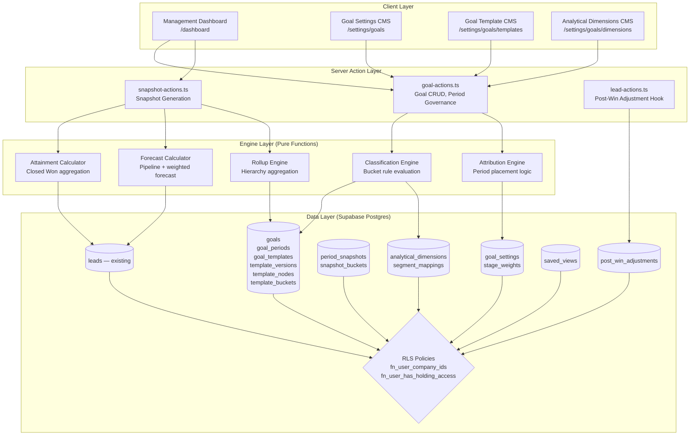

# Design: Goal Management & Management Dashboard

## Overview

This design specifies the technical architecture for a management-grade goal and reporting system within LeadEngine. The system enables Werkudara Group management to define revenue goals, decompose them through configurable hierarchical templates and analytical dimensions, monitor attainment versus forecast in real time for open periods, and review historical performance through immutable snapshot-based closed-period reporting.

The feature integrates with the existing multi-company model (`companies`, `company_members`, RLS via `fn_user_company_ids()` / `fn_user_has_holding_access()`), the RBAC permission matrix (`role_permissions`, `app_modules`), the pipeline stage system (`pipelines`, `pipeline_stages`), and the lead schema (`leads` table with `actual_value`, `estimated_value`, `event_date_start/end`, `company_id`, `pic_sales_id`, `line_industry`, `category`, `lead_source`).

Key design decisions:

- All goal data is company-scoped with holding-level read access, enforced at the RLS layer
- Closed periods are snapshot-based and immutable unless formally reopened with audit trail
- Classification uses a priority-ordered rule engine with mandatory fallback buckets
- Attribution supports both event-date and closed-won-date basis with configurable monthly cutoff
- Attainment is strictly Closed Won + actual_value; forecast is strictly open pipeline
- Template versioning prevents closed-period history mutation
- Five new `app_modules` entries extend the existing RBAC matrix for granular goal permissions

## Architecture

### System Architecture Diagram



### Key Architectural Decisions

1. **Engine layer as pure functions**: Classification, attribution, attainment, and forecast logic are implemented as pure TypeScript functions in `src/features/goals/lib/`. This enables property-based testing without database dependencies.

2. **Server actions as write boundary**: All mutations go through `src/app/actions/goal-actions.ts` (and the existing `lead-actions.ts` for post-win adjustments), consistent with the existing pattern.

3. **RLS as security boundary**: All goal-related tables use the same `fn_user_company_ids()` / `fn_user_has_holding_access()` pattern. UI permission checks via `usePermissions()` are convenience only.

4. **Snapshot immutability**: Closed period data is served exclusively from `period_snapshots` + `snapshot_buckets`. Live recalculation only happens for open periods.

5. **Template versioning**: Goal periods reference a specific `template_version_id`. Edits to published versions adopted by closed periods create new draft versions instead.


## Components and Interfaces

### Route Structure

```
/dashboard                          → Management Dashboard (replaces current / analytics)
/settings/goals                     → Goal Settings CMS landing
/settings/goals/periods             → Goal Period management
/settings/goals/templates           → Goal Template list
/settings/goals/templates/[id]      → Template version editor (tree + bucket rules)
/settings/goals/dimensions          → Analytical Dimension management
/settings/goals/dimensions/[id]     → Dimension detail + segment mappings
```

### Feature Module Structure

```
src/features/goals/
├── components/
│   ├── dashboard/
│   │   ├── management-dashboard.tsx       # Main dashboard shell
│   │   ├── attainment-summary-widget.tsx  # Goal attainment KPI
│   │   ├── pipeline-widget.tsx            # Raw pipeline value
│   │   ├── forecast-widget.tsx            # Weighted forecast
│   │   ├── trend-widget.tsx               # Historical trend chart
│   │   ├── company-breakdown-widget.tsx   # By-company breakdown
│   │   ├── segment-breakdown-widget.tsx   # By-segment breakdown
│   │   ├── sales-contribution-widget.tsx  # By-sales-owner breakdown
│   │   ├── variance-widget.tsx            # Gap indicators
│   │   ├── exception-list-widget.tsx      # Drill-down exception lists
│   │   ├── drill-down-panel.tsx           # Filtered lead detail view
│   │   └── saved-view-selector.tsx        # Saved view load/save UI
│   ├── settings/
│   │   ├── goal-settings-page.tsx         # Goal Settings CMS shell
│   │   ├── period-manager.tsx             # Period CRUD + close/reopen
│   │   ├── attribution-settings.tsx       # Attribution basis + cutoff config
│   │   ├── forecast-settings.tsx          # Weighted forecast toggle + stage weights
│   │   ├── critical-fields-settings.tsx   # Reporting-critical field management
│   │   └── auto-lock-settings.tsx         # Auto-lock schedule config
│   ├── templates/
│   │   ├── template-list-page.tsx         # Template list
│   │   ├── template-editor.tsx            # Version editor shell
│   │   ├── node-tree.tsx                  # Hierarchical node tree (drag-and-drop)
│   │   ├── bucket-rule-builder.tsx        # "is one of" + AND rule builder
│   │   ├── bucket-list.tsx                # Priority-ordered bucket list
│   │   └── target-allocation-panel.tsx    # Manual/percentage/history allocation
│   └── dimensions/
│       ├── dimension-list-page.tsx        # Dimension list
│       ├── dimension-editor.tsx           # Dimension detail + mappings
│       ├── segment-mapping-form.tsx       # Mapping rule form
│       └── classification-preview.tsx     # Live preview of lead classification
├── lib/
│   ├── classification-engine.ts           # Bucket rule evaluation (pure)
│   ├── attribution-engine.ts              # Period placement logic (pure)
│   ├── attainment-calculator.ts           # Closed Won aggregation (pure)
│   ├── forecast-calculator.ts             # Pipeline + weighted forecast (pure)
│   ├── rollup-engine.ts                   # Hierarchy roll-up (pure)
│   └── goal-types.ts                      # Shared type re-exports
└── hooks/
    ├── use-goal-data.ts                   # Dashboard data fetching hook
    ├── use-goal-periods.ts                # Period list + status hook
    └── use-saved-views.ts                 # Saved view CRUD hook
```

### Server Actions

**`src/app/actions/goal-actions.ts`** — New file for all goal-related mutations:

```typescript
// Goal CRUD
createGoalAction(data: GoalInsert): Promise<ActionResult>
updateGoalAction(goalId: string, data: GoalUpdate): Promise<ActionResult>

// Goal Period governance
createGoalPeriodAction(data: GoalPeriodInsert): Promise<ActionResult>
closeGoalPeriodAction(periodId: string): Promise<ActionResult>
reopenGoalPeriodAction(periodId: string, reason: string): Promise<ActionResult>

// Template management
createGoalTemplateAction(data: GoalTemplateInsert): Promise<ActionResult>
createTemplateVersionAction(templateId: string): Promise<ActionResult>
publishTemplateVersionAction(versionId: string): Promise<ActionResult>
updateTemplateNodeAction(nodeId: string, data: TemplateNodeUpdate): Promise<ActionResult>
updateTemplateBucketAction(bucketId: string, data: TemplateBucketUpdate): Promise<ActionResult>

// Analytical Dimensions
createDimensionAction(data: AnalyticalDimensionInsert): Promise<ActionResult>
updateDimensionAction(dimensionId: string, data: AnalyticalDimensionUpdate): Promise<ActionResult>
createSegmentMappingAction(data: SegmentMappingInsert): Promise<ActionResult>
updateSegmentMappingAction(mappingId: string, data: SegmentMappingUpdate): Promise<ActionResult>

// Goal Settings
updateGoalSettingsAction(companyId: string, data: GoalSettingsUpdate): Promise<ActionResult>
updateStageWeightsAction(data: StageWeightUpsert[]): Promise<ActionResult>

// Snapshot
generatePeriodSnapshotAction(periodId: string): Promise<ActionResult>

// Saved Views
createSavedViewAction(data: SavedViewInsert): Promise<ActionResult>
updateSavedViewAction(viewId: string, data: SavedViewUpdate): Promise<ActionResult>
deleteSavedViewAction(viewId: string): Promise<ActionResult>

// Target Allocation
allocateTargetsAction(nodeId: string, mode: 'manual' | 'percentage' | 'history', data: AllocationInput): Promise<ActionResult>
```

**`src/app/actions/lead-actions.ts`** — Extended with post-win adjustment hook:

The existing `updateLeadAction` will be extended to detect when a Closed Won lead's reporting-critical field is modified. When detected, it creates a `post_win_adjustment` record before applying the update.

### Engine Interfaces (Pure Functions)

```typescript
// classification-engine.ts
classifyLead(
  lead: LeadClassificationInput,
  nodes: TemplateNode[],
  buckets: TemplateBucket[],
  dimensions: AnalyticalDimension[],
  mappings: SegmentMapping[]
): BucketAssignment[]

// attribution-engine.ts
attributeLeadToPeriod(
  lead: LeadAttributionInput,
  periods: GoalPeriod[],
  settings: AttributionSettings
): string | null  // returns period_id or null

// attainment-calculator.ts
calculateAttainment(
  leads: LeadAttainmentInput[],
  bucketAssignments: BucketAssignment[]
): AttainmentResult

// forecast-calculator.ts
calculateForecast(
  leads: LeadForecastInput[],
  bucketAssignments: BucketAssignment[],
  stageWeights: StageWeight[],
  weightedEnabled: boolean
): ForecastResult

// rollup-engine.ts
rollUpHierarchy(
  nodes: TemplateNode[],
  bucketValues: Map<string, number>
): HierarchyRollup
```

### Permission Integration

Five new `app_modules` entries are registered in the migration:

| Module ID | Name | Description |
|---|---|---|
| `management_dashboard` | Management Dashboard | Dashboard read access |
| `goal_settings` | Goal Settings | Goal settings CMS management |
| `goal_template` | Goal Templates | Template CRUD |
| `goal_period` | Goal Periods | Period lifecycle management |
| `forecast_settings` | Forecast Settings | Stage weights and forecast toggle |

The existing `usePermissions()` hook and `PermissionGate` component are used for UI gating. The `can()` function already supports arbitrary module IDs, so no changes to the permissions context are needed.

Special permission semantics:
- `goal_period.close` → mapped to `can('goal_period', 'update')` with additional server-side check
- `goal_period.reopen` → mapped to `can('goal_period', 'delete')` (repurposed as the most restrictive action)
- `forecast_settings.manage` → `can('forecast_settings', 'update')`
- `super_admin` bypasses all checks (existing behavior)


## Data Models

### Database Schema

All tables use `uuid` primary keys (via `gen_random_uuid()`), `timestamptz` for timestamps, and `company_id uuid NOT NULL REFERENCES companies(id) ON DELETE CASCADE` for company scoping. RLS is enabled on every table.

#### goals

| Column | Type | Constraints | Description |
|---|---|---|---|
| id | uuid | PK, default gen_random_uuid() | |
| created_at | timestamptz | NOT NULL, default now() | |
| updated_at | timestamptz | NOT NULL, default now() | |
| company_id | uuid | NOT NULL, FK → companies(id) ON DELETE CASCADE | Company scope |
| name | text | NOT NULL | Goal display name |
| period_type | text | NOT NULL, CHECK IN ('monthly','quarterly','yearly') | Planning cadence |
| target_amount | numeric(18,2) | NOT NULL, default 0 | Total revenue target |
| created_by | uuid | FK → profiles(id) | Creating user |
| is_active | boolean | NOT NULL, default true | Soft-delete flag |

#### goal_periods

| Column | Type | Constraints | Description |
|---|---|---|---|
| id | uuid | PK | |
| created_at | timestamptz | NOT NULL, default now() | |
| updated_at | timestamptz | NOT NULL, default now() | |
| goal_id | uuid | NOT NULL, FK → goals(id) ON DELETE CASCADE | Parent goal |
| company_id | uuid | NOT NULL, FK → companies(id) ON DELETE CASCADE | Denormalized for RLS |
| start_date | date | NOT NULL | Period start |
| end_date | date | NOT NULL | Period end |
| status | text | NOT NULL, default 'open', CHECK IN ('open','closed') | Period lifecycle |
| template_version_id | uuid | FK → template_versions(id) | Adopted template snapshot |
| closed_at | timestamptz | | When period was closed |
| closed_by | uuid | FK → profiles(id) | Who closed it |

Index: `(goal_id, start_date)`, `(company_id, status)`

#### goal_templates

| Column | Type | Constraints | Description |
|---|---|---|---|
| id | uuid | PK | |
| created_at | timestamptz | NOT NULL, default now() | |
| updated_at | timestamptz | NOT NULL, default now() | |
| company_id | uuid | NOT NULL, FK → companies(id) ON DELETE CASCADE | Company scope |
| name | text | NOT NULL | Template display name |
| description | text | | Optional description |
| created_by | uuid | FK → profiles(id) | Creating user |

#### template_versions

| Column | Type | Constraints | Description |
|---|---|---|---|
| id | uuid | PK | |
| created_at | timestamptz | NOT NULL, default now() | |
| template_id | uuid | NOT NULL, FK → goal_templates(id) ON DELETE CASCADE | Parent template |
| company_id | uuid | NOT NULL, FK → companies(id) ON DELETE CASCADE | Denormalized for RLS |
| version_number | int | NOT NULL | Sequential version |
| status | text | NOT NULL, default 'draft', CHECK IN ('draft','published','archived') | Version lifecycle |
| published_at | timestamptz | | When published |
| published_by | uuid | FK → profiles(id) | Who published |

Constraint: Partial unique index `(template_id) WHERE status = 'published'` — enforces at most one published version per template.

#### template_nodes

| Column | Type | Constraints | Description |
|---|---|---|---|
| id | uuid | PK | |
| created_at | timestamptz | NOT NULL, default now() | |
| template_version_id | uuid | NOT NULL, FK → template_versions(id) ON DELETE CASCADE | Parent version |
| company_id | uuid | NOT NULL, FK → companies(id) ON DELETE CASCADE | Denormalized for RLS |
| parent_node_id | uuid | FK → template_nodes(id) ON DELETE CASCADE | Null for root node |
| level_order | int | NOT NULL, default 0 | Sort within siblings |
| dimension_type | text | NOT NULL | 'company_id', 'pic_sales_id', or analytical_dimension.id |
| display_name | text | NOT NULL | Level display name |

#### template_buckets

| Column | Type | Constraints | Description |
|---|---|---|---|
| id | uuid | PK | |
| created_at | timestamptz | NOT NULL, default now() | |
| node_id | uuid | NOT NULL, FK → template_nodes(id) ON DELETE CASCADE | Parent node |
| company_id | uuid | NOT NULL, FK → companies(id) ON DELETE CASCADE | Denormalized for RLS |
| bucket_name | text | NOT NULL | Display name (e.g., "BFSI") |
| classification_rules | jsonb | NOT NULL, default '[]' | Array of {field, operator, values} |
| priority_order | int | NOT NULL, default 0 | Lower = higher priority |
| is_fallback | boolean | NOT NULL, default false | Fallback bucket flag |
| target_amount | numeric(18,2) | NOT NULL, default 0 | Allocated target |
| allocation_mode | text | default 'manual', CHECK IN ('manual','percentage','history') | How target was set |
| allocation_percentage | numeric(5,2) | | Percentage if mode = 'percentage' |

#### analytical_dimensions

| Column | Type | Constraints | Description |
|---|---|---|---|
| id | uuid | PK | |
| created_at | timestamptz | NOT NULL, default now() | |
| updated_at | timestamptz | NOT NULL, default now() | |
| company_id | uuid | NOT NULL, FK → companies(id) ON DELETE CASCADE | Company scope |
| dimension_name | text | NOT NULL | e.g., "Segment" |
| source_field | text | NOT NULL | Lead field name, e.g., "line_industry" |
| description | text | | Optional description |
| fallback_segment_name | text | NOT NULL, default 'Unmapped' | Fallback segment label |

Unique: `(company_id, dimension_name)`

#### segment_mappings

| Column | Type | Constraints | Description |
|---|---|---|---|
| id | uuid | PK | |
| created_at | timestamptz | NOT NULL, default now() | |
| dimension_id | uuid | NOT NULL, FK → analytical_dimensions(id) ON DELETE CASCADE | Parent dimension |
| company_id | uuid | NOT NULL, FK → companies(id) ON DELETE CASCADE | Denormalized for RLS |
| segment_name | text | NOT NULL | e.g., "BFSI" |
| match_values | text[] | NOT NULL | Array of source field values |
| priority_order | int | NOT NULL, default 0 | Lower = higher priority |

#### goal_settings

One row per company. Stores global defaults.

| Column | Type | Constraints | Description |
|---|---|---|---|
| id | uuid | PK | |
| created_at | timestamptz | NOT NULL, default now() | |
| updated_at | timestamptz | NOT NULL, default now() | |
| company_id | uuid | NOT NULL, UNIQUE, FK → companies(id) ON DELETE CASCADE | One per company |
| attribution_basis | text | NOT NULL, default 'event_date', CHECK IN ('event_date','closed_won_date') | Global default |
| monthly_cutoff_day | int | default 25, CHECK BETWEEN 1 AND 28 | Single global cutoff |
| per_month_cutoffs | jsonb | | Optional per-month overrides: {"1": 25, "2": 28, ...} |
| weighted_forecast_enabled | boolean | NOT NULL, default false | Forecast toggle |
| auto_lock_enabled | boolean | NOT NULL, default false | Auto-lock toggle |
| auto_lock_day_offset | int | default 5 | Days after period end to auto-lock |
| reporting_critical_fields | text[] | NOT NULL, default '{actual_value,event_date_start,event_date_end,project_name,company_id,pic_sales_id}' | Protected field list |

#### stage_weights

| Column | Type | Constraints | Description |
|---|---|---|---|
| id | uuid | PK | |
| created_at | timestamptz | NOT NULL, default now() | |
| company_id | uuid | NOT NULL, FK → companies(id) ON DELETE CASCADE | Company scope |
| pipeline_id | uuid | FK → pipelines(id) ON DELETE CASCADE | Null = global default |
| stage_id | uuid | NOT NULL, FK → pipeline_stages(id) ON DELETE CASCADE | Pipeline stage |
| weight_percent | int | NOT NULL, CHECK BETWEEN 0 AND 100 | Probability weight |

Unique: `(company_id, pipeline_id, stage_id)` where pipeline_id can be null via COALESCE.

#### period_snapshots

| Column | Type | Constraints | Description |
|---|---|---|---|
| id | uuid | PK | |
| created_at | timestamptz | NOT NULL, default now() | |
| period_id | uuid | NOT NULL, FK → goal_periods(id) ON DELETE CASCADE | Parent period |
| company_id | uuid | NOT NULL, FK → companies(id) ON DELETE CASCADE | Denormalized for RLS |
| revision | int | NOT NULL, default 1 | Revision number (increments on reopen) |
| template_version_id | uuid | NOT NULL, FK → template_versions(id) | Frozen template ref |
| attribution_basis | text | NOT NULL | Frozen attribution basis |
| monthly_cutoff_config | jsonb | NOT NULL | Frozen cutoff config |
| total_attainment | numeric(18,2) | NOT NULL, default 0 | Total attainment at close |
| total_forecast_raw | numeric(18,2) | NOT NULL, default 0 | Total raw pipeline at close |
| total_forecast_weighted | numeric(18,2) | NOT NULL, default 0 | Total weighted forecast at close |
| snapshot_metadata | jsonb | | Additional frozen state |
| created_by | uuid | FK → profiles(id) | Who triggered snapshot |
| reason | text | | Reason (for reopen revisions) |

Unique: `(period_id, revision)`

#### snapshot_buckets

| Column | Type | Constraints | Description |
|---|---|---|---|
| id | uuid | PK | |
| snapshot_id | uuid | NOT NULL, FK → period_snapshots(id) ON DELETE CASCADE | Parent snapshot |
| company_id | uuid | NOT NULL, FK → companies(id) ON DELETE CASCADE | Denormalized for RLS |
| node_id | uuid | NOT NULL | Frozen node reference |
| bucket_id | uuid | NOT NULL | Frozen bucket reference |
| bucket_name | text | NOT NULL | Frozen bucket name |
| attainment | numeric(18,2) | NOT NULL, default 0 | Bucket attainment |
| forecast_raw | numeric(18,2) | NOT NULL, default 0 | Bucket raw pipeline |
| forecast_weighted | numeric(18,2) | NOT NULL, default 0 | Bucket weighted forecast |
| target_amount | numeric(18,2) | NOT NULL, default 0 | Frozen target |
| lead_count_won | int | NOT NULL, default 0 | Won lead count |
| lead_count_pipeline | int | NOT NULL, default 0 | Pipeline lead count |

#### post_win_adjustments

| Column | Type | Constraints | Description |
|---|---|---|---|
| id | uuid | PK | |
| created_at | timestamptz | NOT NULL, default now() | |
| company_id | uuid | NOT NULL, FK → companies(id) ON DELETE CASCADE | Denormalized for RLS |
| lead_id | int | NOT NULL, FK → leads(id) ON DELETE CASCADE | Affected lead |
| field_name | text | NOT NULL | Changed field |
| old_value | text | | Previous value (stringified) |
| new_value | text | | New value (stringified) |
| changed_by | uuid | NOT NULL, FK → profiles(id) | Actor |
| reason | text | | Adjustment reason |
| affects_closed_period | boolean | NOT NULL, default false | Flags if a closed period is affected |
| reviewed | boolean | NOT NULL, default false | Review status |

#### saved_views

| Column | Type | Constraints | Description |
|---|---|---|---|
| id | uuid | PK | |
| created_at | timestamptz | NOT NULL, default now() | |
| updated_at | timestamptz | NOT NULL, default now() | |
| company_id | uuid | NOT NULL, FK → companies(id) ON DELETE CASCADE | Company scope |
| user_id | uuid | NOT NULL, FK → profiles(id) | Owner |
| name | text | NOT NULL | View name |
| is_shared | boolean | NOT NULL, default false | Shared flag |
| view_config | jsonb | NOT NULL | Serialized filter/layout state |

#### period_audit_log

| Column | Type | Constraints | Description |
|---|---|---|---|
| id | uuid | PK | |
| created_at | timestamptz | NOT NULL, default now() | |
| period_id | uuid | NOT NULL, FK → goal_periods(id) ON DELETE CASCADE | Affected period |
| company_id | uuid | NOT NULL, FK → companies(id) ON DELETE CASCADE | Denormalized for RLS |
| action | text | NOT NULL, CHECK IN ('close','reopen','snapshot_revision') | Audit action |
| actor_id | uuid | NOT NULL, FK → profiles(id) | Who performed |
| reason | text | | Reason (required for reopen) |
| metadata | jsonb | | Additional context |

### RLS Policy Pattern

All goal-related tables follow the same RLS pattern as existing tables:

```sql
-- SELECT: company members + holding access
CREATE POLICY "{table}_select" ON public.{table} FOR SELECT
  USING (
    company_id = ANY(public.fn_user_company_ids())
    OR public.fn_user_has_holding_access()
  );

-- INSERT: must be member of target company
CREATE POLICY "{table}_insert" ON public.{table} FOR INSERT
  WITH CHECK (company_id = ANY(public.fn_user_company_ids()));

-- UPDATE: must be member of target company
CREATE POLICY "{table}_update" ON public.{table} FOR UPDATE
  USING (company_id = ANY(public.fn_user_company_ids()))
  WITH CHECK (company_id = ANY(public.fn_user_company_ids()));

-- DELETE: must be member of target company
CREATE POLICY "{table}_delete" ON public.{table} FOR DELETE
  USING (company_id = ANY(public.fn_user_company_ids()));
```

Exception: `saved_views` has an additional SELECT constraint — personal views are only visible to the owner, shared views are visible to all company members:

```sql
CREATE POLICY "saved_views_select" ON public.saved_views FOR SELECT
  USING (
    (user_id = auth.uid())
    OR (is_shared = true AND (
      company_id = ANY(public.fn_user_company_ids())
      OR public.fn_user_has_holding_access()
    ))
  );
```

### TypeScript Types

**`src/types/goals.ts`**:

```typescript
// ── Core Entities ──

export interface Goal {
  id: string
  created_at: string
  updated_at: string
  company_id: string
  name: string
  period_type: 'monthly' | 'quarterly' | 'yearly'
  target_amount: number
  created_by: string | null
  is_active: boolean
}

export type GoalInsert = Omit<Goal, 'id' | 'created_at' | 'updated_at'>
export type GoalUpdate = Partial<GoalInsert>

export interface GoalPeriod {
  id: string
  created_at: string
  updated_at: string
  goal_id: string
  company_id: string
  start_date: string
  end_date: string
  status: 'open' | 'closed'
  template_version_id: string | null
  closed_at: string | null
  closed_by: string | null
}

export type GoalPeriodInsert = Omit<GoalPeriod, 'id' | 'created_at' | 'updated_at' | 'closed_at' | 'closed_by'>
export type GoalPeriodUpdate = Partial<GoalPeriodInsert>

export interface GoalTemplate {
  id: string
  created_at: string
  updated_at: string
  company_id: string
  name: string
  description: string | null
  created_by: string | null
}

export type GoalTemplateInsert = Omit<GoalTemplate, 'id' | 'created_at' | 'updated_at'>

export interface TemplateVersion {
  id: string
  created_at: string
  template_id: string
  company_id: string
  version_number: number
  status: 'draft' | 'published' | 'archived'
  published_at: string | null
  published_by: string | null
}

export interface TemplateNode {
  id: string
  created_at: string
  template_version_id: string
  company_id: string
  parent_node_id: string | null
  level_order: number
  dimension_type: string
  display_name: string
}

export type TemplateNodeUpdate = Partial<Pick<TemplateNode, 'parent_node_id' | 'level_order' | 'dimension_type' | 'display_name'>>

export interface TemplateBucket {
  id: string
  created_at: string
  node_id: string
  company_id: string
  bucket_name: string
  classification_rules: ClassificationRule[]
  priority_order: number
  is_fallback: boolean
  target_amount: number
  allocation_mode: 'manual' | 'percentage' | 'history'
  allocation_percentage: number | null
}

export type TemplateBucketUpdate = Partial<Pick<TemplateBucket,
  'bucket_name' | 'classification_rules' | 'priority_order' | 'is_fallback' |
  'target_amount' | 'allocation_mode' | 'allocation_percentage'
>>

// ── Classification Rules ──

export interface ClassificationRule {
  field: string          // lead field name
  operator: 'is_one_of'  // V1 only supports this operator
  values: string[]        // matching values
}

// ── Analytical Dimensions ──

export interface AnalyticalDimension {
  id: string
  created_at: string
  updated_at: string
  company_id: string
  dimension_name: string
  source_field: string
  description: string | null
  fallback_segment_name: string
}

export type AnalyticalDimensionInsert = Omit<AnalyticalDimension, 'id' | 'created_at' | 'updated_at'>
export type AnalyticalDimensionUpdate = Partial<AnalyticalDimensionInsert>

export interface SegmentMapping {
  id: string
  created_at: string
  dimension_id: string
  company_id: string
  segment_name: string
  match_values: string[]
  priority_order: number
}

export type SegmentMappingInsert = Omit<SegmentMapping, 'id' | 'created_at'>
export type SegmentMappingUpdate = Partial<SegmentMappingInsert>

// ── Settings ──

export interface GoalSettings {
  id: string
  created_at: string
  updated_at: string
  company_id: string
  attribution_basis: 'event_date' | 'closed_won_date'
  monthly_cutoff_day: number
  per_month_cutoffs: Record<string, number> | null
  weighted_forecast_enabled: boolean
  auto_lock_enabled: boolean
  auto_lock_day_offset: number
  reporting_critical_fields: string[]
}

export type GoalSettingsUpdate = Partial<Pick<GoalSettings,
  'attribution_basis' | 'monthly_cutoff_day' | 'per_month_cutoffs' |
  'weighted_forecast_enabled' | 'auto_lock_enabled' | 'auto_lock_day_offset' |
  'reporting_critical_fields'
>>

export interface StageWeight {
  id: string
  created_at: string
  company_id: string
  pipeline_id: string | null
  stage_id: string
  weight_percent: number
}

export type StageWeightUpsert = Pick<StageWeight, 'company_id' | 'pipeline_id' | 'stage_id' | 'weight_percent'>

// ── Snapshots ──

export interface PeriodSnapshot {
  id: string
  created_at: string
  period_id: string
  company_id: string
  revision: number
  template_version_id: string
  attribution_basis: string
  monthly_cutoff_config: Record<string, unknown>
  total_attainment: number
  total_forecast_raw: number
  total_forecast_weighted: number
  snapshot_metadata: Record<string, unknown> | null
  created_by: string | null
  reason: string | null
}

export interface SnapshotBucket {
  id: string
  snapshot_id: string
  company_id: string
  node_id: string
  bucket_id: string
  bucket_name: string
  attainment: number
  forecast_raw: number
  forecast_weighted: number
  target_amount: number
  lead_count_won: number
  lead_count_pipeline: number
}

// ── Post-Win Adjustments ──

export interface PostWinAdjustment {
  id: string
  created_at: string
  company_id: string
  lead_id: number
  field_name: string
  old_value: string | null
  new_value: string | null
  changed_by: string
  reason: string | null
  affects_closed_period: boolean
  reviewed: boolean
}

// ── Saved Views ──

export interface SavedView {
  id: string
  created_at: string
  updated_at: string
  company_id: string
  user_id: string
  name: string
  is_shared: boolean
  view_config: SavedViewConfig
}

export interface SavedViewConfig {
  period_id: string | null
  company_id_filter: string | null
  template_id: string | null
  attribution_basis: string | null
  filters: Record<string, string[]>
  widget_order: string[]
}

export type SavedViewInsert = Omit<SavedView, 'id' | 'created_at' | 'updated_at'>
export type SavedViewUpdate = Partial<Pick<SavedView, 'name' | 'is_shared' | 'view_config'>>

// ── Engine Input/Output Types ──

export interface LeadClassificationInput {
  id: number
  company_id: string
  pic_sales_id: string | null
  line_industry: string | null
  category: string | null
  lead_source: string | null
  [key: string]: unknown  // dynamic field access
}

export interface BucketAssignment {
  lead_id: number
  node_id: string
  bucket_id: string
  bucket_name: string
}

export interface AttributionSettings {
  attribution_basis: 'event_date' | 'closed_won_date'
  monthly_cutoff_day: number
  per_month_cutoffs: Record<string, number> | null
}

export interface LeadAttributionInput {
  id: number
  event_date_end: string | null
  closed_won_date: string | null
}

export interface AttainmentResult {
  total: number
  by_bucket: Map<string, number>
  lead_count: number
}

export interface ForecastResult {
  total_raw: number
  total_weighted: number
  by_bucket_raw: Map<string, number>
  by_bucket_weighted: Map<string, number>
  lead_count: number
}

export interface HierarchyRollup {
  node_id: string
  display_name: string
  attainment: number
  forecast_raw: number
  forecast_weighted: number
  target: number
  children: HierarchyRollup[]
}

// ── Period Audit ──

export interface PeriodAuditEntry {
  id: string
  created_at: string
  period_id: string
  company_id: string
  action: 'close' | 'reopen' | 'snapshot_revision'
  actor_id: string
  reason: string | null
  metadata: Record<string, unknown> | null
}
```

### Classification Engine Logic

The classification engine evaluates bucket rules in priority order for each template node level:

```
For each template_node at a given level:
  1. Sort buckets by priority_order ASC (lower = higher priority)
  2. For each non-fallback bucket:
     a. Evaluate all classification_rules with AND logic
     b. Each rule: lead[rule.field] must be in rule.values (is_one_of)
     c. If ALL rules match → assign lead to this bucket, stop
  3. If no bucket matched → assign to the fallback bucket
  4. Return exactly one BucketAssignment per node level
```

For dimension-type nodes (e.g., "segment"):
- First resolve the lead's field value through the analytical dimension's segment mappings
- Then use the resolved segment name for bucket matching

### Attribution Engine Logic

```
Given a lead and attribution settings:
  1. Determine attributed_date:
     - If basis = 'event_date': use lead.event_date_end (or event_date_start if end is null)
     - If basis = 'closed_won_date': use lead.closed_won_date
  2. Determine effective cutoff for the attributed_date's month:
     - If per_month_cutoffs has an entry for this month → use it
     - Otherwise → use monthly_cutoff_day
  3. If attributed_date.day > cutoff → shift to next month's period
  4. Find the goal_period whose date range contains the (possibly shifted) date
  5. Return period_id or null if no matching period
```

### Attainment and Forecast Calculation

**Attainment** (open periods only — closed periods use snapshot):
```
Filter leads where:
  - pipeline_stage.closed_status = 'won'
  - attributed period matches the target period
Sum actual_value grouped by bucket assignment
```

**Forecast** (open periods only):
```
Filter leads where:
  - pipeline_stage.stage_type = 'open' (not closed won, not lost)
  - attributed period matches the target period
Raw: sum estimated_value (or actual_value where available)
Weighted: sum (value × stage_weight_percent / 100)
```

### Snapshot Generation Strategy

When a period is closed:
1. Calculate attainment and forecast for all buckets using current live data
2. Create a `period_snapshot` row with frozen totals and config
3. Create `snapshot_bucket` rows for each node/bucket combination
4. Set `goal_periods.status = 'closed'` and record `closed_at`, `closed_by`
5. Insert `period_audit_log` entry with action = 'close'

On reopen:
1. Set `goal_periods.status = 'open'`
2. Recalculate from live data
3. Create new `period_snapshot` with incremented revision
4. Insert `period_audit_log` entry with action = 'reopen' + reason


## Correctness Properties

*A property is a characteristic or behavior that should hold true across all valid executions of a system — essentially, a formal statement about what the system should do. Properties serve as the bridge between human-readable specifications and machine-verifiable correctness guarantees.*

### Property 1: Single Published Version Invariant

*For any* goal template with multiple versions, after publishing a version, there SHALL be exactly one version with status "published" and all previously published versions SHALL have status "archived".

**Validates: Requirements 1.5, 11.2**

### Property 2: Fallback Bucket Invariant

*For any* valid template node with a non-empty bucket list, there SHALL be exactly one bucket with `is_fallback = true`.

**Validates: Requirements 1.8**

### Property 3: Classification Completeness and Determinism

*For any* lead and any template node with at least one fallback bucket, the classification engine SHALL assign the lead to exactly one bucket. If the lead matches multiple non-fallback buckets, it SHALL be assigned to the one with the lowest `priority_order`. If no non-fallback bucket matches, it SHALL be assigned to the fallback bucket.

**Validates: Requirements 2.3, 2.4, 3.1, 3.2, 3.3, 3.4, 3.5**

### Property 4: Overlap Detection Correctness

*For any* set of segment mappings (or bucket rules) within the same dimension (or node), the overlap detection function SHALL return a warning if and only if at least one source field value appears in multiple mappings (or multiple non-fallback bucket rules match the same lead field combination).

**Validates: Requirements 2.5, 3.6**

### Property 5: Attribution Engine Period Placement

*For any* lead with a valid attributed date and a set of goal periods, the attribution engine SHALL place the lead into the correct period based on the configured basis (event_date_end or closed_won_date) and monthly cutoff rule. Specifically: if the attributed date's day-of-month exceeds the effective cutoff for that month, the lead SHALL be attributed to the next month's period.

**Validates: Requirements 4.1, 4.2, 4.3**

### Property 6: Attainment Calculation Correctness

*For any* set of leads and a target goal period, the attainment calculator SHALL return a total equal to the sum of `actual_value` from leads that are (a) in the Closed Won stage AND (b) attributed to the target period by the attribution engine. Leads in any other stage or attributed to a different period SHALL contribute zero to attainment.

**Validates: Requirements 7.1, 7.2, 7.3, 7.4**

### Property 7: Forecast Exclusion Correctness

*For any* set of leads, the forecast calculator SHALL include only leads in open pipeline stages (not Closed Won, not Lost). The raw forecast total SHALL equal the sum of `estimated_value` (or `actual_value` where available) from these open-stage leads.

**Validates: Requirements 8.1, 8.7, 8.8**

### Property 8: Weighted Forecast Calculation

*For any* set of open-stage leads and a stage weight configuration, the weighted forecast for each lead SHALL equal `lead_value × stage_weight_percent / 100`, and the total weighted forecast SHALL equal the sum of individual weighted values.

**Validates: Requirements 8.2**

### Property 9: Hierarchy Rollup Sum Invariant

*For any* template hierarchy tree with computed leaf-bucket values, the value at every parent node SHALL equal the sum of its children's values (within a configurable rounding tolerance of ±1 IDR). This holds for attainment, raw forecast, and weighted forecast independently.

**Validates: Requirements 7.5, 20.1, 20.2, 20.3, 20.4**

### Property 10: Post-Win Adjustment Detection

*For any* update to a Closed Won lead, if the update modifies a field in the reporting-critical-fields list, the system SHALL produce a post-win adjustment record capturing the field name, old value, and new value. If the lead's attributed date falls within a closed goal period, the adjustment SHALL be flagged with `affects_closed_period = true`.

**Validates: Requirements 9.2, 9.4**

### Property 11: Minimum Critical Field Set Preservation

*For any* attempted update to the `reporting_critical_fields` list in goal settings, the resulting list SHALL always contain the mandatory minimum set: `{actual_value, event_date_start, event_date_end, project_name, company_id, pic_sales_id}`. Fields may be added but the minimum set SHALL never be removed.

**Validates: Requirements 9.6**

### Property 12: Percentage Allocation Sum Constraint

*For any* parent node target and a set of child bucket percentage allocations that sum to 100%, the resulting child target amounts SHALL sum to the parent target amount (within a rounding tolerance of ±1 IDR).

**Validates: Requirements 10.2, 10.5**

### Property 13: Version Protection for Closed-Period Adopted Versions

*For any* published template version that is adopted by at least one closed goal period, an edit operation SHALL produce a new draft version rather than modifying the adopted version. The adopted version's structure SHALL remain unchanged.

**Validates: Requirements 11.4**


## Error Handling

### Server Action Error Handling

All goal server actions follow the existing `ActionResult` pattern from `lead-actions.ts`:

```typescript
type ActionResult = { success: boolean; error?: string; data?: Record<string, unknown> }
```

Error categories and handling:

| Error Category | Handling | User Feedback |
|---|---|---|
| Validation errors (invalid period_type, cutoff out of range, percentages not summing to 100%) | Return `{ success: false, error: "..." }` before DB call | Toast with specific validation message |
| RLS violation (user not member of target company) | Supabase returns error | Toast: "You don't have access to this company's data" |
| Constraint violation (duplicate published version, missing fallback bucket) | Supabase returns error | Toast with specific constraint message |
| FK violation (deleting referenced template version) | Supabase returns error | Toast: "Cannot delete — this version is in use by a goal period" |
| Snapshot generation failure (no leads found, calculation error) | Catch in snapshot action, return error | Toast: "Snapshot generation failed" + error detail |
| Permission denied (missing goal_settings.manage, etc.) | Server-side permission check before mutation | Toast: "You don't have permission for this action" |

### Classification Engine Error Handling

- If a bucket's `classification_rules` JSON is malformed → skip that bucket, log warning, continue to next
- If a lead field referenced in a rule doesn't exist → treat as non-match for that rule
- If no fallback bucket exists for a node (data integrity issue) → throw error, do not silently drop the lead

### Attribution Engine Error Handling

- If a lead has no attributed date (both event_date_end and closed_won_date are null) → exclude from period attribution, log warning
- If no goal period covers the attributed date → return null (lead is unattributed for goal purposes)
- If cutoff configuration is invalid (day > 28) → clamp to 28

### Snapshot Generation Error Handling

- If snapshot generation fails mid-way → transaction rollback, period remains open
- If a reopen is attempted on an already-open period → return error, no-op
- If a close is attempted on an already-closed period → return error, no-op

### Post-Win Adjustment Error Handling

- If the user lacks permission to modify critical fields on won leads → return `{ success: false, error: "Special permission required..." }`
- If reason is not provided for a critical field change → return validation error

## Testing Strategy

### Dual Testing Approach

This feature uses both unit tests and property-based tests for comprehensive coverage:

- **Property-based tests** (via `fast-check`): Verify universal properties across randomly generated inputs for the pure engine functions (classification, attribution, attainment, forecast, rollup, allocation, overlap detection, adjustment detection, field set validation, version management)
- **Unit tests** (via `vitest`): Verify specific examples, edge cases, CMS behavior, permission checks, and integration points

### Property-Based Testing Configuration

- Library: `fast-check` (TypeScript PBT library)
- Minimum iterations: 100 per property test
- Test files: `src/features/goals/lib/__tests__/*.property.test.ts`
- Each test is tagged with a comment referencing the design property:
  - Tag format: `Feature: goal-management, Property {number}: {property_text}`

### Property Test Coverage Map

| Property | Engine/Module | Test File |
|---|---|---|
| Property 1: Single Published Version | Template Service | `template-version.property.test.ts` |
| Property 2: Fallback Bucket Invariant | Template Validation | `template-validation.property.test.ts` |
| Property 3: Classification Completeness | Classification Engine | `classification-engine.property.test.ts` |
| Property 4: Overlap Detection | Classification Engine | `classification-engine.property.test.ts` |
| Property 5: Attribution Period Placement | Attribution Engine | `attribution-engine.property.test.ts` |
| Property 6: Attainment Calculation | Attainment Calculator | `attainment-calculator.property.test.ts` |
| Property 7: Forecast Exclusion | Forecast Calculator | `forecast-calculator.property.test.ts` |
| Property 8: Weighted Forecast | Forecast Calculator | `forecast-calculator.property.test.ts` |
| Property 9: Hierarchy Rollup Sum | Rollup Engine | `rollup-engine.property.test.ts` |
| Property 10: Post-Win Adjustment Detection | Adjustment Service | `adjustment-detection.property.test.ts` |
| Property 11: Minimum Critical Field Set | Goal Settings Validation | `goal-settings-validation.property.test.ts` |
| Property 12: Percentage Allocation Sum | Allocation Service | `allocation.property.test.ts` |
| Property 13: Version Protection | Template Service | `template-version.property.test.ts` |

### Unit Test Coverage

Unit tests cover:
- Server action happy paths and error cases
- CMS form validation (Zod schemas)
- Permission gate behavior
- Snapshot generation workflow
- Period close/reopen lifecycle
- Saved view CRUD
- Dashboard widget rendering with mock data
- Edge cases: empty lead sets, single-bucket nodes, zero targets, boundary cutoff dates

### Integration Test Coverage

Integration tests (against Supabase) cover:
- RLS policy enforcement for all goal-related tables
- FK constraint enforcement (template version deletion prevention)
- Snapshot immutability (UPDATE rejection on closed snapshots)
- Permission-based access control for goal actions
- End-to-end period close → snapshot → reopen → revision flow

