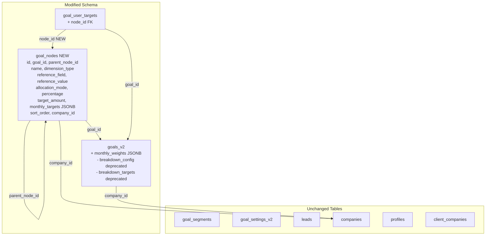
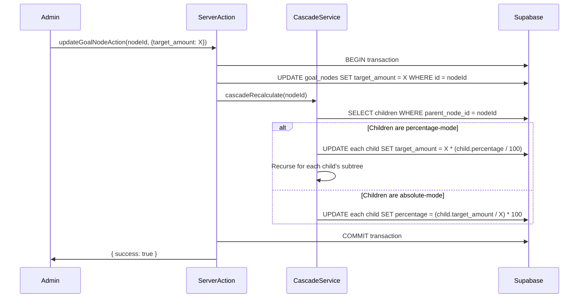
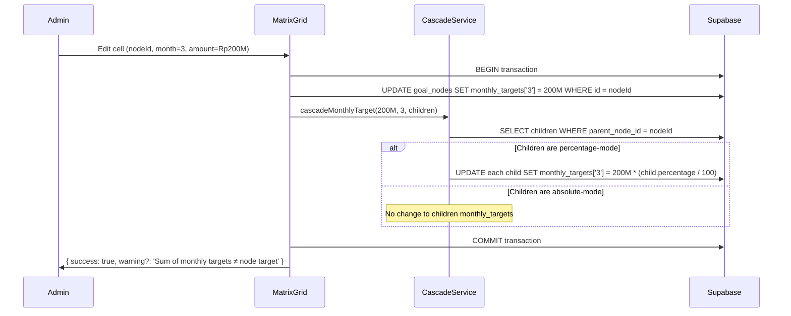

# Design: Goal Node Tree (goal-period-targets)

## Overview

This design evolves LeadEngine's goal breakdown system from JSONB-based `breakdown_config`/`breakdown_targets` columns on `goals_v2` to a relational `goal_nodes` table with self-referencing `parent_node_id` FK. The current JSONB approach (implemented in the `goal-system-redesign` spec) works for flat breakdowns but cannot express the real business hierarchy — subsidiaries with regions, regions with source clients, source clients with revenue streams — each with independent allocation modes and per-node target amounts that cascade when parents change.

The redesign introduces:
- A `goal_nodes` table with self-referencing `parent_node_id` for unlimited-depth trees
- `monthly_weights` JSONB on `goals_v2` for default period-based target distribution
- `monthly_targets` JSONB on `goal_nodes` for per-node per-month target overrides
- Updated `goal_user_targets` with optional `node_id` FK for node-scoped user targets
- Updated engine functions (attribution, attainment, forecast) that operate per-node using ancestor path matching
- A matrix grid UI (spreadsheet-like) for visual node × month management with hierarchy, amounts, and percentages
- A monthly weights editor UI for default period distribution

### Design Rationale

The JSONB approach served V1 well — single-row reads, no JOINs, flexible nesting. But it has fundamental limitations:

1. **No referential integrity**: JSONB keys are strings, not FK-constrained UUIDs. A deleted subsidiary leaves orphan keys.
2. **No per-node allocation modes**: The JSONB tree can't express "this sibling group uses percentage mode, that one uses absolute mode."
3. **No cascade recalculation**: Changing a parent's target requires client-side tree traversal and full JSONB rewrite.
4. **No node-level user targets**: `goal_user_targets` can only attach to the goal root, not to a specific node.
5. **No efficient subtree queries**: Filtering to a subsidiary's subtree requires loading and parsing the entire JSONB blob.

The relational `goal_nodes` table solves all five issues while preserving the existing 4-table schema (`goals_v2`, `goal_segments`, `goal_user_targets`, `goal_settings_v2`).

### Key Design Decisions

1. **Relational over JSONB for nodes**: Nodes need FK constraints, RLS, indexes, and per-row updates. JSONB can't provide these.
2. **`monthly_weights` stays JSONB on `goals_v2`**: Weights are always read/written as a unit (12 values), rarely queried individually. JSONB is the right fit. These serve as the DEFAULT distribution pattern.
3. **`monthly_targets` JSONB on `goal_nodes`**: Per-node per-month overrides. Takes precedence over `goal.monthly_weights` when non-empty. Keys are month number strings `"1"`–`"12"`, values are absolute amounts. Sum validation warns but doesn't block.
4. **Allocation mode per node, enforced per sibling group**: Stored on each node row for query simplicity; application logic enforces sibling consistency.
5. **Cascade recalculation in application layer**: Postgres triggers would add hidden complexity. Server actions handle cascade within a transaction.
6. **Ancestor path matching for attribution**: A lead contributes to a node only if it matches every ancestor's `reference_field`/`reference_value` from root to node. This is computed at query time, not stored.
7. **Deprecate, don't drop**: `breakdown_config` and `breakdown_targets` become nullable and are no longer written to. Migration converts existing data to `goal_nodes` rows.
8. **Matrix grid over tree editor**: The primary UI is a spreadsheet-like matrix grid (rows = node hierarchy, columns = months) rather than a standalone tree editor. This gives admins a single view to see and edit all node × month targets. Month is ALWAYS the column axis, never a dimension in the row hierarchy.
9. **Per-node monthly targets over computed-only**: Storing explicit per-node monthly amounts (rather than always computing from weights) allows admins to set uneven distributions per node. The fallback to `goal.monthly_weights` keeps things simple when overrides aren't needed.



## Architecture

### System Layers

```mermaid
graph TB
    subgraph "UI Layer"
        GSP[Goal Settings Page<br/>/settings/goals]
        MG[Goal Matrix Grid<br/>goal-matrix-grid.tsx]
        MWE[Monthly Weights Editor<br/>monthly-weights-editor.tsx]
        DB[Dashboard<br/>management-dashboard.tsx]
        LD[Lead Detail<br/>lead goal attribution]
        UP[User Profile<br/>node-scoped targets]
    end

    subgraph "Server Actions Layer"
        GA[goal-actions.ts<br/>existing + new node CRUD]
        NA[createGoalNodeAction<br/>updateGoalNodeAction<br/>deleteGoalNodeAction<br/>reorderGoalNodesAction]
    end

    subgraph "Service Layer (Pure Functions)"
        CS[cascade-service.ts<br/>cascadeRecalculate()]
        TC[target-calculator.ts<br/>computePeriodTarget()<br/>computeMonthlyTarget()]
        NA2[node-attribution.ts<br/>matchLeadToNodes()<br/>buildAncestorPath()]
    end

    subgraph "Existing Engine Layer"
        CE[classification-engine.ts<br/>classifyLeadBySegment()]
        AE[attribution-engine.ts<br/>attributeLeadToPeriodV2()]
        AC[attainment-calculator.ts<br/>calculateAttainmentV2()]
        FC[forecast-calculator.ts<br/>calculateForecastV2()]
    end

    subgraph "Data Layer (Supabase + RLS)"
        GNDB[(goal_nodes)]
        GV2DB[(goals_v2)]
        GUTDB[(goal_user_targets)]
        GSDB[(goal_segments)]
        GSV2DB[(goal_settings_v2)]
    end

    GSP --> GA
    MG --> NA
    MG --> TC
    MWE --> GA
    DB --> NA2
    DB --> TC
    LD --> NA2
    UP --> GUTDB

    NA --> CS
    NA --> GNDB
    GA --> GV2DB

    CS --> GNDB
    TC --> GV2DB
    NA2 --> CE
    NA2 --> GNDB

    DB --> AC
    DB --> FC
    DB --> AE
```

### Migration Strategy

The migration runs as a single Supabase migration file:

1. **Create `goal_nodes` table** with all columns, constraints, and indexes
2. **Add `monthly_weights` to `goals_v2`** with default `'{}'::jsonb`
3. **Add `node_id` to `goal_user_targets`** with FK to `goal_nodes(id)` ON DELETE SET NULL
4. **Enable RLS on `goal_nodes`** with SELECT/INSERT/UPDATE/DELETE policies
5. **Migrate existing data**: Read `breakdown_config` and `breakdown_targets` from each `goals_v2` row, create corresponding `goal_nodes` rows
6. **Mark deprecated columns**: Set `breakdown_config` and `breakdown_targets` as nullable (no longer written to by application)

The migration is idempotent — it checks for existing `goal_nodes` rows before inserting to prevent duplicates on re-run.

### Cascade Recalculation Flow



### Per-Month Cell Edit Cascade Flow



## Components and Interfaces

### Matrix Grid Layout

The primary UI for goal breakdown is a spreadsheet-like matrix grid:

```
                    | Jan 2026 | Feb 2026 | Mar 2026 | ... | Q1 Total | YTD Total
ROW HIERARCHY       |          |          |          |     |          |
─────────────────────┼──────────┼──────────┼──────────┼─────┼──────────┼──────────
▼ L1 Wedding Revenue | Rp 350M  | Rp 400M  | Rp 350M  | ... | Rp 1.10B | Rp 1.45B
                     |    24%   |    27%   |    24%   |     |    76%   |   100%
  ▼ L2 Jakarta Mkt   | Rp 200M  | Rp 250M  | Rp 200M  | ... | Rp 650M  | Rp 850M
                     |    57%   |    62%   |    57%   |     |    59%   |    58%
    L3 Team Alpha    | Rp 120M  | Rp 150M  | Rp 115M  | ... | Rp 385M  | Rp 500M
                     |    60%   |    60%   |    57%   |     |    59%   |    58%
    L3 Team Beta     | Rp 80M   | Rp 100M  | Rp 85M   | ... | Rp 265M  | Rp 350M
                     |    40%   |    40%   |    43%   |     |    41%   |    42%
  ▷ L2 Bali Market   | Rp 150M  | Rp 150M  | Rp 150M  | ... | Rp 450M  | Rp 600M
▷ L1 Corporate Events| Rp 500M  | Rp 600M  | Rp 500M  | ... | Rp 1.60B | Rp 2.10B
```

Key layout rules:
- **Rows** = node hierarchy (expand/collapse via ▼/▷, indented by level). Only business dimensions (subsidiary, region, stream, etc.) — month is NEVER a tree level.
- **Columns** = months within configured timeframe + Q Total + YTD Total computed columns.
- **Each cell** shows amount (top line) + percentage of parent (bottom line).
- **Cell editing**: click cell → input amount OR percentage → the other auto-computes.
- **Display Metrics toggle**: Nominal only / Percent only / Both.
- **Hierarchy Levels bar**: shows configured levels (e.g., Event Type → Market → Planner Team) with + Add Level.
- **Timeframe Setup**: date range picker for which months to show as columns.
- **Cascade**: editing a parent cell cascades to percentage-mode children in the same month.

### SQL DDL

#### goal_nodes table

```sql
CREATE TABLE public.goal_nodes (
  id uuid DEFAULT gen_random_uuid() PRIMARY KEY,
  created_at timestamptz NOT NULL DEFAULT now(),
  updated_at timestamptz NOT NULL DEFAULT now(),
  goal_id uuid NOT NULL REFERENCES public.goals_v2(id) ON DELETE CASCADE,
  parent_node_id uuid REFERENCES public.goal_nodes(id) ON DELETE CASCADE,
  name text NOT NULL,
  dimension_type text NOT NULL DEFAULT 'custom',
  reference_field text NOT NULL,
  reference_value text NOT NULL,
  allocation_mode text NOT NULL DEFAULT 'absolute'
    CHECK (allocation_mode IN ('percentage', 'absolute')),
  percentage numeric(7,4),
  target_amount numeric(18,2) NOT NULL DEFAULT 0
    CHECK (target_amount >= 0),
  monthly_targets jsonb NOT NULL DEFAULT '{}'::jsonb,
  sort_order integer NOT NULL DEFAULT 0,
  company_id uuid NOT NULL REFERENCES public.companies(id) ON DELETE CASCADE
);

-- Indexes for efficient tree traversal
CREATE INDEX idx_goal_nodes_goal ON public.goal_nodes (goal_id);
CREATE INDEX idx_goal_nodes_parent ON public.goal_nodes (parent_node_id);
CREATE INDEX idx_goal_nodes_goal_parent ON public.goal_nodes (goal_id, parent_node_id);
CREATE INDEX idx_goal_nodes_company ON public.goal_nodes (company_id);
```

#### goals_v2 modification

```sql
ALTER TABLE public.goals_v2
  ADD COLUMN monthly_weights jsonb NOT NULL DEFAULT '{}'::jsonb;

-- breakdown_config and breakdown_targets become nullable (deprecated)
ALTER TABLE public.goals_v2
  ALTER COLUMN breakdown_config DROP NOT NULL;
ALTER TABLE public.goals_v2
  ALTER COLUMN breakdown_targets DROP NOT NULL;
```

#### goal_user_targets modification

```sql
ALTER TABLE public.goal_user_targets
  ADD COLUMN node_id uuid REFERENCES public.goal_nodes(id) ON DELETE SET NULL;

CREATE INDEX idx_goal_user_targets_node ON public.goal_user_targets (node_id);
```

#### RLS Policies for goal_nodes

```sql
ALTER TABLE public.goal_nodes ENABLE ROW LEVEL SECURITY;

CREATE POLICY "goal_nodes_select" ON public.goal_nodes
  FOR SELECT USING (
    company_id = ANY(public.fn_user_company_ids())
    OR public.fn_user_has_holding_access()
  );

CREATE POLICY "goal_nodes_insert" ON public.goal_nodes
  FOR INSERT WITH CHECK (
    company_id = ANY(public.fn_user_company_ids())
  );

CREATE POLICY "goal_nodes_update" ON public.goal_nodes
  FOR UPDATE
  USING (company_id = ANY(public.fn_user_company_ids()))
  WITH CHECK (company_id = ANY(public.fn_user_company_ids()));

CREATE POLICY "goal_nodes_delete" ON public.goal_nodes
  FOR DELETE USING (
    company_id = ANY(public.fn_user_company_ids())
  );
```

### TypeScript Types (`src/types/goals.ts` additions)

```typescript
// ── Goal Node Types ──

export type AllocationMode = 'percentage' | 'absolute'

export interface GoalNode {
  id: string
  created_at: string
  updated_at: string
  goal_id: string
  parent_node_id: string | null
  name: string
  dimension_type: string
  reference_field: string
  reference_value: string
  allocation_mode: AllocationMode
  percentage: number | null
  target_amount: number
  monthly_targets: MonthlyTargets | null
  sort_order: number
  company_id: string
}

export type GoalNodeInsert = Omit<GoalNode, 'id' | 'created_at' | 'updated_at'>
export type GoalNodeUpdate = Partial<Omit<GoalNodeInsert, 'goal_id' | 'company_id'>>

/** In-memory tree representation for recursive rendering */
export interface GoalNodeTree extends GoalNode {
  children: GoalNodeTree[]
  // Computed at runtime, not stored
  attainment?: number
  forecast_raw?: number
  forecast_weighted?: number
}

// ── GoalV2 additions ──
// Add to existing GoalV2 interface:
//   monthly_weights: Record<string, number> | null

// ── GoalUserTarget additions ──
// Add to existing GoalUserTarget interface:
//   node_id: string | null

// ── Monthly Weights type (goal-level default distribution) ──
export type MonthlyWeights = Record<string, number>  // keys "1"-"12", values sum to 1.0

// ── Monthly Targets type (per-node override, absolute amounts) ──
export type MonthlyTargets = Record<string, number>  // keys "1"-"12", values are absolute amounts
```

### Server Action Signatures (`src/app/actions/goal-actions.ts` additions)

```typescript
// ── Goal Node CRUD ──

export async function createGoalNodeAction(data: GoalNodeInsert): Promise<ActionResult>
// Validates:
//   - reference_field is valid (Lead_Field_Registry or segment:{id} pattern)
//   - all siblings share same allocation_mode
//   - percentage in [0, 100] when allocation_mode = 'percentage'
//   - target_amount >= 0
//   - parent_node_id references a node within the same goal_id
// After insert: triggers cascade recalculation if parent has percentage-mode children

export async function updateGoalNodeAction(
  nodeId: string,
  data: GoalNodeUpdate
): Promise<ActionResult>
// Validates same rules as create
// After update: triggers cascade recalculation for affected subtree

export async function deleteGoalNodeAction(nodeId: string): Promise<ActionResult>
// Deletes node and all descendants (CASCADE via FK)
// After delete: recalculates sibling percentages if needed

export async function reorderGoalNodesAction(
  nodeIds: string[]
): Promise<ActionResult>
// Updates sort_order for a set of sibling nodes
// nodeIds[0] gets sort_order 0, nodeIds[1] gets 1, etc.
```

### Engine Function Signatures

#### Cascade Service (`src/features/goals/lib/cascade-service.ts`)

```typescript
/**
 * Recursively recalculates child targets when a parent's target_amount changes.
 * - Percentage-mode children: target_amount = parent_target × (percentage / 100)
 * - Absolute-mode children: percentage = (target_amount / parent_target) × 100
 * Returns all updated node IDs for batch database update.
 */
export function cascadeRecalculate(
  parentTarget: number,
  children: GoalNode[]
): { id: string; target_amount: number; percentage: number | null }[]

/**
 * Cascades a per-month cell edit to children for a specific month.
 * - Percentage-mode children: monthly_targets[month] = new_parent_monthly × (child.percentage / 100)
 * - Absolute-mode children: no change to monthly_targets[month]
 * Returns updated node IDs with their new monthly_targets for batch update.
 */
export function cascadeMonthlyTarget(
  parentMonthlyTarget: number,
  month: number,  // 1-12
  children: GoalNode[]
): { id: string; monthly_targets: MonthlyTargets }[]

/**
 * Validates that the sum of root-level node targets does not exceed
 * the goal's target_amount. Returns a warning message if it does.
 */
export function validateRootNodeSum(
  goalTarget: number,
  rootNodes: Pick<GoalNode, 'target_amount'>[]
): { valid: boolean; warning?: string }
```

#### Target Calculator (`src/features/goals/lib/target-calculator.ts`)

```typescript
/**
 * Computes a node's target for a specific month.
 * If node has monthly_targets[month], returns that value directly (per-node override).
 * Otherwise returns node.target_amount × monthly_weights[month].
 * If monthly_weights is also empty/null, uses equal distribution (1/12).
 */
export function computeMonthlyTarget(
  nodeTarget: number,
  monthlyWeights: MonthlyWeights | null,
  month: number,  // 1-12
  monthlyTargets?: MonthlyTargets | null
): number

/**
 * Computes a node's target for a date range by summing applicable monthly values.
 * For each month in range: uses monthly_targets[month] if available (per-node override),
 * otherwise uses node.target_amount × monthly_weights[month].
 * Full months use their full value; partial months are pro-rated by day fraction.
 */
export function computePeriodTarget(
  nodeTarget: number,
  monthlyWeights: MonthlyWeights | null,
  periodStart: string,  // YYYY-MM-DD
  periodEnd: string,    // YYYY-MM-DD
  monthlyTargets?: MonthlyTargets | null
): number

/**
 * Validates monthly weights: all non-negative, sum to 1.0 within tolerance.
 */
export function validateMonthlyWeights(
  weights: MonthlyWeights
): { valid: boolean; error?: string }

/**
 * Validates per-node monthly targets: warns if sum of 12 months ≠ node.target_amount.
 * Does NOT block — returns warning only.
 */
export function validateMonthlyTargets(
  monthlyTargets: MonthlyTargets,
  nodeTargetAmount: number
): { valid: boolean; warning?: string }
```

#### Node Attribution (`src/features/goals/lib/node-attribution.ts`)

```typescript
/**
 * Builds the ancestor path for a node — the ordered list of
 * { reference_field, reference_value } pairs from root to node.
 */
export function buildAncestorPath(
  nodeId: string,
  allNodes: GoalNode[]
): { reference_field: string; reference_value: string }[]

/**
 * Determines if a lead matches a node by checking the lead's field values
 * against every ancestor's reference_field/reference_value in the path.
 * For segment references, classifies the lead first using GoalSegment mappings.
 */
export function matchLeadToNode(
  lead: Record<string, unknown>,
  ancestorPath: { reference_field: string; reference_value: string }[],
  segments: GoalSegment[],
  clientCompany: Record<string, unknown> | null
): boolean

/**
 * For a given goal's node tree, returns all leaf node IDs that a lead
 * contributes to. Used for lead detail page display.
 */
export function findLeadNodePaths(
  lead: Record<string, unknown>,
  allNodes: GoalNode[],
  segments: GoalSegment[],
  clientCompany: Record<string, unknown> | null
): string[]  // array of node IDs
```

### Component Structure

#### New Components

| Component | Path | Purpose |
|-----------|------|---------|
| `GoalMatrixGrid` | `src/features/goals/components/settings/goal-matrix-grid.tsx` | Spreadsheet-like matrix grid: rows = node hierarchy (expand/collapse), columns = months + Q Total + YTD Total. Each cell shows amount + % of parent. Supports cell editing (amount or percentage), cascade on edit, display metrics toggle (Nominal/Percent/Both), hierarchy levels bar, and timeframe setup. |
| `MonthlyWeightsEditor` | `src/features/goals/components/settings/monthly-weights-editor.tsx` | Grid editor for 12-month default weight distribution on `goals_v2.monthly_weights` |
| `NodePicker` | `src/features/goals/components/settings/node-picker.tsx` | Tree-based node selector for user target assignment |
| `NodeBreakdownWidget` | `src/features/goals/components/dashboard/node-breakdown-widget.tsx` | Dashboard tree widget showing per-node attainment/forecast |
| `PeriodSelector` | `src/features/goals/components/shared/period-selector.tsx` | Period filter control (week/month/quarter/year/custom) |

#### Modified Components

| Component | Changes |
|-----------|---------|
| `goal-settings-page.tsx` | Add Goal Matrix Grid section and Monthly Weights Editor section |
| `goal-manager.tsx` | Remove `BreakdownSelector` (replaced by Goal Matrix Grid); add monthly_weights to create/edit dialogs |
| `goal-breakdown.tsx` | Replace JSONB tree rendering with `goal_nodes` query; use `NodeBreakdownWidget` |
| `management-dashboard.tsx` | Add `PeriodSelector`; replace breakdown widgets with node-based tree widget |
| `use-goal-data.ts` | Add node-level attainment/forecast computation; accept period parameters from `PeriodSelector`; resolve `monthly_targets` fallback |
| `company-breakdown-widget.tsx` | Read from `goal_nodes` where `reference_field = 'company_id'` instead of JSONB |
| `segment-breakdown-widget.tsx` | Read from `goal_nodes` where `reference_field` starts with `'segment:'` |
| `sales-contribution-widget.tsx` | Read from `goal_nodes` where `reference_field = 'pic_sales_id'` |

#### Unchanged Components

- `attribution-settings.tsx` — still reads/writes attribution fields on `goals_v2`

## Matrix Page Layout

### Dedicated /goals Route

Route: `/goals` (new page)
- Sidebar: add "Goals" nav item below Pipeline, above Companies, icon: Target
- Page layout: sticky header (64px) + toolbar (hierarchy pills, timeframe, display toggle) + matrix table
- Configuration: side panel (540px, slide from right) triggered by header button

### Component File Structure

```
src/
├── app/goals/page.tsx                     # Goals matrix page
├── features/goals/components/
│   ├── matrix/
│   │   ├── goal-matrix.tsx                # Main matrix container
│   │   ├── goal-matrix-toolbar.tsx        # Hierarchy levels + timeframe + display toggle
│   │   ├── goal-matrix-table.tsx          # Table with pinned hierarchy column
│   │   ├── goal-matrix-row.tsx            # Single row (hierarchy + value cells)
│   │   ├── goal-matrix-cell.tsx           # Value cell (nominal/percent/both)
│   │   ├── goal-matrix-cell-editor.tsx    # Inline cell editor (double-click)
│   │   ├── goal-summary-row.tsx           # Sticky bottom total row
│   │   ├── goal-unallocated-row.tsx       # Warning/error row
│   │   └── goal-context-menu.tsx          # Right-click context menu
│   ├── config/
│   │   ├── goal-config-panel.tsx          # Side panel container
│   │   ├── goal-config-overview.tsx       # Name, period, year, target, status
│   │   ├── goal-config-weights.tsx        # Monthly weight distribution grid
│   │   └── goal-config-hierarchy.tsx      # Hierarchy level ordering (drag)
│   └── shared/
│       └── period-selector.tsx            # Period filter (week/month/quarter/year)
```

### Design Tokens

Level badge colors:
- L1: `#6366f1` (Indigo)
- L2: `#0ea5e9` (Sky)
- L3: `#8b5cf6` (Violet)
- L4: `#10b981` (Emerald)
- L5: `#f59e0b` (Amber)

Attainment cell tints:
- ≥100%: `rgba(16,185,129, 0.06)` green
- 70-99%: `rgba(99,102,241, 0.04)` indigo
- 40-69%: `rgba(245,158,11, 0.06)` amber
- <40%: `rgba(239,68,68, 0.05)` red

Matrix dimensions:
- Row height: 48px
- Hierarchy column: 280px (pinned left)
- Month column min-width: 100px
- Summary column width: 110px
- Level indent: 24px per level
- `forecast-settings.tsx` — still reads/writes `stage_weights` on `goal_settings_v2`
- `critical-fields-settings.tsx` — unchanged
- `auto-lock-settings.tsx` — unchanged
- `segment-settings.tsx` — unchanged (segments are still managed separately)
- `saved-view-selector.tsx` — unchanged

## Data Models

### goal_nodes

| Column | Type | Constraints | Description |
|--------|------|-------------|-------------|
| `id` | uuid | PK, default `gen_random_uuid()` | Node identifier |
| `created_at` | timestamptz | NOT NULL, default `now()` | Creation timestamp |
| `updated_at` | timestamptz | NOT NULL, default `now()` | Last update timestamp |
| `goal_id` | uuid | NOT NULL, FK → `goals_v2(id)` ON DELETE CASCADE | Parent goal |
| `parent_node_id` | uuid | FK → `goal_nodes(id)` ON DELETE CASCADE, nullable | Parent node (NULL = root-level child of goal) |
| `name` | text | NOT NULL | Display name (e.g., "WNW", "Jakarta", "BFSI") |
| `dimension_type` | text | NOT NULL, default `'custom'` | Semantic label: `'subsidiary'`, `'region'`, `'source_client'`, `'stream'`, `'segment'`, `'sales_owner'`, `'custom'` |
| `reference_field` | text | NOT NULL | Lead field key or `'segment:{id}'` pattern |
| `reference_value` | text | NOT NULL | Value to match against lead data |
| `allocation_mode` | text | NOT NULL, CHECK IN (`'percentage'`, `'absolute'`), default `'absolute'` | How targets are entered for this sibling group |
| `percentage` | numeric(7,4) | nullable | Admin-entered percentage (when mode = percentage) or computed display percentage (when mode = absolute) |
| `target_amount` | numeric(18,2) | NOT NULL, CHECK >= 0, default 0 | Target revenue for this node |
| `monthly_targets` | jsonb | NOT NULL, default `'{}'::jsonb` | Per-node per-month target overrides. Keys `"1"`–`"12"`, values are absolute amounts. Empty = fallback to `goal.monthly_weights`. |
| `sort_order` | integer | NOT NULL, default 0 | Display order within sibling group |
| `company_id` | uuid | NOT NULL, FK → `companies(id)` ON DELETE CASCADE | Tenant isolation |

Indexes:
- `(goal_id)` — fetch all nodes for a goal
- `(parent_node_id)` — fetch children of a node
- `(goal_id, parent_node_id)` — efficient tree traversal
- `(company_id)` — RLS performance

### goals_v2 additions

| Column | Type | Default | Description |
|--------|------|---------|-------------|
| `monthly_weights` | jsonb | `'{}'::jsonb` | Month-keyed weights summing to 1.0. Example: `{"1": 0.05, "2": 0.07, ..., "12": 0.10}` |

Deprecated columns (nullable, no longer written to):
- `breakdown_config` — replaced by `goal_nodes` tree structure
- `breakdown_targets` — replaced by `goal_nodes.target_amount`

### goal_user_targets additions

| Column | Type | Default | Description |
|--------|------|---------|-------------|
| `node_id` | uuid | NULL | FK → `goal_nodes(id)` ON DELETE SET NULL. Scopes user target to a specific node. NULL = goal-level target. |

### Monthly Weights JSONB Structure

```json
{
  "1": 0.02,
  "2": 0.04,
  "3": 0.06,
  "4": 0.08,
  "5": 0.09,
  "6": 0.10,
  "7": 0.10,
  "8": 0.11,
  "9": 0.11,
  "10": 0.10,
  "11": 0.10,
  "12": 0.09
}
```

Rules:
- Keys are month number strings `"1"` through `"12"`
- Values are decimal fractions (not percentages)
- All values must be >= 0
- Sum must equal 1.0 within tolerance of 0.001
- Empty/null = equal distribution (each month = 1/12)

### Per-Node Monthly Targets JSONB Structure (`goal_nodes.monthly_targets`)

```json
{
  "1": 42000000,
  "2": 84000000,
  "3": 126000000,
  "4": 168000000,
  "5": 210000000,
  "6": 252000000,
  "7": 294000000,
  "8": 336000000,
  "9": 378000000,
  "10": 420000000,
  "11": 462000000,
  "12": 504000000
}
```

Rules:
- Keys are month number strings `"1"` through `"12"`
- Values are absolute amounts (in IDR) for that node in that month
- Sum of 12 months SHOULD equal `node.target_amount` — warn if not, don't block saves
- Empty/null = fallback to `node.target_amount × goal.monthly_weights[month]`
- Each cell is independently editable — NOT forced to equal distribution

Priority resolution:
1. If `node.monthly_targets[month]` exists and is non-empty → use that value directly
2. Else if `goal.monthly_weights[month]` exists → compute `node.target_amount × goal.monthly_weights[month]`
3. Else → compute `node.target_amount × (1/12)` (equal distribution default)

### Migration Data Mapping

For each `goals_v2` row with non-empty `breakdown_config` and `breakdown_targets`:

| Source (JSONB) | Target (goal_nodes) |
|----------------|---------------------|
| `breakdown_config[0].field` | `reference_field` |
| `breakdown_config[0].label` | `dimension_type` |
| `breakdown_targets` top-level key | `reference_value` + `name` |
| `breakdown_targets[key]._target` | `target_amount` |
| Nested keys | Child nodes with `parent_node_id` set |
| All migrated nodes | `allocation_mode = 'absolute'` |


## Correctness Properties

*A property is a characteristic or behavior that should hold true across all valid executions of a system — essentially, a formal statement about what the system should do. Properties serve as the bridge between human-readable specifications and machine-verifiable correctness guarantees.*

### Property 1: Cascade recalculation preserves allocation invariant

*For any* goal node tree where a parent node's `target_amount` changes: if the parent's children use `allocation_mode = 'percentage'`, then after cascade recalculation, each child's `target_amount` SHALL equal `new_parent_target × (child.percentage / 100)`, and this SHALL propagate recursively through the entire subtree. If the parent's children use `allocation_mode = 'absolute'`, then after cascade recalculation, each child's `target_amount` SHALL remain unchanged and each child's `percentage` SHALL equal `(child.target_amount / new_parent_target) × 100`.

**Validates: Requirements 1.4, 1.5, 2.1, 2.2, 2.3, 2.4**

### Property 2: Monthly weights validation

*For any* `MonthlyWeights` object, the validation function SHALL accept it if and only if all twelve weight values are non-negative AND the sum of all twelve values equals 1.0 within a tolerance of 0.001. *For any* object containing a negative value or a sum outside the tolerance, the validation function SHALL reject it.

**Validates: Requirements 3.3, 3.4, 20.6**

### Property 3: Period target computation with default fallback

*For any* node `target_amount`, *for any* valid `MonthlyWeights` (or null), and *for any* date range `[periodStart, periodEnd]`: the computed period target SHALL equal `target_amount × sum(applicable monthly weights)`, where full months use their full weight and partial months are pro-rated by the fraction of days within the range. When `MonthlyWeights` is null or empty, each month's weight SHALL default to `1/12`. The period target for a single full month SHALL equal `target_amount × weight[month]`, and for a full quarter SHALL equal `target_amount × sum(weight[m] for m in quarter)`.

**Validates: Requirements 3.5, 3.6, 3.7, 3.8, 13.4, 13.5, 13.6**

### Property 4: Node cross-reference validation

*For any* `parent_node_id` value on a goal node, the validation function SHALL reject it if the referenced parent node belongs to a different `goal_id` than the child node. *For any* `node_id` value on a `goal_user_target`, the validation function SHALL reject it if the referenced node belongs to a different `goal_id` than the user target. Valid same-goal references SHALL be accepted.

**Validates: Requirements 1.2, 5.4, 10.4**

### Property 5: Node input validation

*For any* goal node creation or update input: (a) the validation function SHALL reject `reference_field` values that are not present in `Lead_Field_Registry` and do not match the `segment:{uuid}` pattern; (b) the validation function SHALL reject `percentage` values outside [0, 100] when `allocation_mode = 'percentage'`; (c) the validation function SHALL reject negative `target_amount` values; (d) the validation function SHALL reject a node whose `allocation_mode` differs from its existing siblings under the same parent.

**Validates: Requirements 1.3, 17.5, 17.6, 17.7, 17.8**

### Property 6: Ancestor path lead matching

*For any* goal node tree and *for any* lead record, the `matchLeadToNode` function SHALL return true for a node if and only if the lead's field values match every ancestor's `reference_field`/`reference_value` pair from root to that node. For `reference_field` values starting with `'segment:'`, the lead's raw field value SHALL be classified using the referenced `GoalSegment`'s mappings before comparison. For `reference_field` values with `valueSource.type = 'client_company_field'`, the value SHALL be resolved from the lead's joined `client_company` record. Leads with NULL values for a required `reference_field` SHALL not match nodes referencing that field.

**Validates: Requirements 4.2, 4.3, 4.4, 4.5, 4.6, 7.3, 8.1, 8.2, 8.4, 14.1, 14.2**

### Property 7: Per-node attainment correctness

*For any* goal node tree and *for any* set of leads with mixed pipeline stages, the attainment computed for a node SHALL equal the sum of `actual_value` from leads where `is_closed_won === true` AND the lead matches the node's full ancestor path. Leads that are not Closed Won or do not match the ancestor path SHALL contribute zero.

**Validates: Requirements 19.1, 19.6**

### Property 8: Per-node forecast correctness

*For any* goal node tree and *for any* set of leads with mixed pipeline stages, the forecast computed for a node SHALL equal the sum of `estimated_value` from open-stage leads (excluding Closed Won and Lost) that match the node's full ancestor path. When weighted forecast is enabled, each lead's contribution SHALL be multiplied by its stage weight from `goal_settings_v2.stage_weights`.

**Validates: Requirements 19.2, 19.3**

### Property 9: Rollup parent equals sum of children

*For any* goal node tree with computed attainment and forecast values, at every non-leaf node, the node's attainment SHALL equal the sum of its children's attainment values within a rounding tolerance of 0.01, and the node's forecast SHALL equal the sum of its children's forecast values within the same tolerance.

**Validates: Requirements 19.4, 19.5**

### Property 10: Migration transformation preserves targets

*For any* valid `breakdown_config` array and `breakdown_targets` JSONB object from `goals_v2`, the migration transformation function SHALL produce `goal_nodes` rows where: (a) each top-level key in `breakdown_targets` becomes a root-level node with `target_amount` equal to the key's `_target` value; (b) nested keys become child nodes with correct `parent_node_id`; (c) all nodes have `allocation_mode = 'absolute'`; (d) running the transformation twice produces the same set of nodes (idempotency).

**Validates: Requirements 16.2, 16.3, 16.4, 16.5, 16.7**

### Property 11: Subsidiary tree filtering preserves subtree structure

*For any* goal node tree and *for any* subsidiary `company_id`, filtering the tree to that subsidiary SHALL return only nodes whose root-level ancestor has `reference_field = 'company_id'` AND `reference_value` matching the subsidiary ID. The filtered subtree SHALL preserve its internal parent-child hierarchy and depth structure.

**Validates: Requirements 11.1, 11.3**

### Property 12: Root node sum warning

*For any* goal with `target_amount` and *for any* set of root-level nodes (nodes with `parent_node_id = NULL`), the validation function SHALL return a warning if the sum of root-level node `target_amount` values exceeds the goal's `target_amount`, and SHALL return no warning if the sum is at or below the goal's `target_amount`.

**Validates: Requirements 2.6**

### Property 13: Per-node monthly targets sum validation

*For any* goal node with a non-empty `monthly_targets` object containing all 12 month keys, the sum of `monthly_targets["1"]` through `monthly_targets["12"]` SHOULD equal `node.target_amount`. The validation function SHALL return a warning (not an error) when the sum differs from `node.target_amount`, and SHALL return no warning when the sum equals `node.target_amount` within a tolerance of 0.01.

**Validates: Requirements 21.5**

### Property 14: Per-node monthly targets override precedence

*For any* goal node with a non-empty `monthly_targets` object and *for any* month `m` in 1–12, the computed monthly target SHALL equal `monthly_targets[m]` regardless of the goal's `monthly_weights[m]` value. *For any* goal node with an empty or null `monthly_targets` object, the computed monthly target SHALL equal `node.target_amount × goal.monthly_weights[m]` (or `node.target_amount / 12` when `monthly_weights` is also empty/null).

**Validates: Requirements 21.3, 21.4**

### Property 15: Matrix grid cell cascade for per-month edits

*For any* parent node cell edit in month `m` where the parent's children use `allocation_mode = 'percentage'`, after cascade each child's `monthly_targets[m]` SHALL equal `new_parent_monthly_target[m] × (child.percentage / 100)`. Children with `allocation_mode = 'absolute'` SHALL retain their `monthly_targets[m]` unchanged.

**Validates: Requirements 22.9**

## Error Handling

### Server Action Errors

All server actions return `ActionResult = { success: boolean; error?: string; data?: Record<string, unknown> }`. Error categories:

| Error Category | Handling |
|---|---|
| Authentication failure | Return `{ success: false, error: 'Not authenticated' }` before any DB operation |
| Cross-goal parent reference | Return `{ success: false, error: 'Parent node must belong to the same goal' }` |
| Mixed sibling allocation modes | Return `{ success: false, error: 'All siblings must use the same allocation mode' }` |
| Percentage out of range | Return `{ success: false, error: 'Percentage must be between 0 and 100' }` |
| Negative target amount | Return `{ success: false, error: 'Target amount must be non-negative' }` |
| Invalid reference_field | Return `{ success: false, error: 'Invalid reference field: <field>' }` |
| Invalid node_id on user target | Return `{ success: false, error: 'Node must belong to the same goal as the target' }` |
| Monthly weights negative value | Return `{ success: false, error: 'All monthly weights must be non-negative' }` |
| Monthly weights sum mismatch | Return `{ success: false, error: 'Monthly weights must sum to 1.0 (currently: <sum>)' }` |
| Monthly targets sum mismatch | Return `{ success: true, warning: 'Sum of monthly targets (<sum>) does not equal node target amount (<target>)' }` — warning only, does not block |
| Supabase error (RLS denial, FK violation) | Return `{ success: false, error: error.message }` from Supabase response |

### Cascade Recalculation Errors

- All cascade operations run within a single database transaction
- If any update fails, the entire transaction rolls back — no partial cascade state
- Division by zero in percentage computation (parent_target = 0): set percentage to 0 for all children

### Engine Function Edge Cases

Pure engine functions handle edge cases defensively:
- `cascadeRecalculate(0, children)` → sets all children's percentage to 0 (avoids division by zero)
- `cascadeMonthlyTarget(0, month, children)` → sets all percentage-mode children's monthly_targets[month] to 0
- `computeMonthlyTarget(target, null, month, null)` → returns `target / 12` (equal distribution default)
- `computeMonthlyTarget(target, weights, month, monthlyTargets)` → returns `monthlyTargets[month]` when present (override takes precedence)
- `computePeriodTarget(target, weights, start, end, null)` where start > end → returns 0
- `validateMonthlyTargets({}, 100000)` → returns `{ valid: true }` (empty = no override, no warning)
- `validateMonthlyTargets({"1": 50000, ..., "12": 50000}, 100000)` → returns warning if sum ≠ 100000
- `matchLeadToNode(lead, [], ...)` → returns true (empty ancestor path = root match)
- `buildAncestorPath(nodeId, [])` → returns empty array
- `validateMonthlyWeights({})` → rejects (must have all 12 months)
- `findLeadNodePaths(lead, [], ...)` → returns empty array

### Root Node Sum Warning

The root node sum check returns a warning (not an error). The UI displays the warning but does not block saves — admins may intentionally allocate less than 100% of the goal target to nodes (e.g., keeping a buffer).

## Testing Strategy

### Property-Based Tests (fast-check)

Property-based tests use [fast-check](https://github.com/dubzzz/fast-check) with minimum 100 iterations per property. Each test references its design property.

Target files:
- `src/features/goals/lib/__tests__/cascade-service.property.test.ts` — Property 1 (cascade invariant), Property 12 (root sum warning), Property 15 (per-month cascade)
- `src/features/goals/lib/__tests__/target-calculator.property.test.ts` — Property 2 (weights validation), Property 3 (period target computation), Property 13 (monthly targets sum validation), Property 14 (monthly targets override precedence)
- `src/features/goals/lib/__tests__/node-validation.property.test.ts` — Property 4 (cross-reference), Property 5 (input validation)
- `src/features/goals/lib/__tests__/node-attribution.property.test.ts` — Property 6 (ancestor path matching), Property 7 (per-node attainment), Property 8 (per-node forecast), Property 9 (rollup invariant)
- `src/features/goals/lib/__tests__/migration-transform.property.test.ts` — Property 10 (migration transformation)
- `src/features/goals/lib/__tests__/tree-filtering.property.test.ts` — Property 11 (subsidiary filtering)

Tag format: `// Feature: goal-period-targets, Property N: <property text>`

### Unit Tests (example-based)

Example-based tests for specific scenarios and edge cases:
- Cascade with zero parent target (division by zero edge case)
- Per-month cascade with percentage-mode children (verify monthly_targets update)
- Per-month cascade with absolute-mode children (verify no change)
- Period target for a single day, a full year, a week spanning month boundary
- Period target with monthly_targets override vs monthly_weights fallback
- Monthly targets sum validation: exact match, mismatch warning, empty object
- Ancestor path matching with NULL client_company_id
- Migration of empty breakdown_targets (no nodes created)
- Migration of deeply nested breakdown_targets (3+ levels)
- Node validation with segment:{uuid} reference_field pattern
- Subsidiary filtering with no matching nodes (empty result)
- Monthly weights with exactly 12 equal values (1/12 each)
- Period selector preset computation for edge dates (Jan 1, Dec 31, leap year Feb 29)
- Matrix grid cell edit: amount entry auto-computes percentage, percentage entry auto-computes amount

### Integration Tests

Integration tests against Supabase (using test database):
- Goal node CRUD round-trip (create → read → update → delete)
- Cascade recalculation within transaction (verify atomicity)
- RLS policy verification (company-scoped access, holding access)
- FK constraint enforcement (parent_node_id within same goal, node_id on user targets)
- Migration data preservation (old JSONB → new relational nodes)
- ON DELETE CASCADE behavior (deleting a node removes descendants)
- ON DELETE SET NULL behavior (deleting a node nullifies user target node_id)

### Test Balance

- Property tests cover the 15 correctness properties (pure function logic)
- Unit tests cover ~18-22 specific examples and edge cases
- Integration tests cover ~10-15 database/RLS/FK scenarios
- Property tests handle comprehensive input coverage; unit tests focus on specific edge cases and error messages
- Existing property tests from `goal-system-redesign` (attainment calculator, forecast calculator, classification engine, attribution engine) remain valid and are not duplicated
