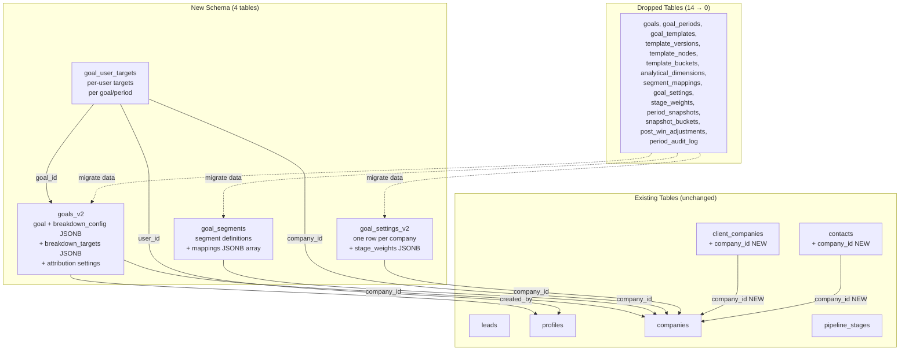

# Design: Goal System Redesign

## Overview

This design replaces LeadEngine's over-engineered 14-table goal system with a flat, JSONB-driven 4-table model. The redesign collapses the deep join chain (`goals → goal_periods → goal_templates → template_versions → template_nodes → template_buckets`) into a single `goals_v2` row that carries breakdown configuration and targets as JSONB columns. Segments move from a two-table model (`analytical_dimensions` + `segment_mappings`) to a single `goal_segments` table with JSONB mappings. Stage weights move from a dedicated table into a JSONB column on `goal_settings_v2`.

The redesign also fixes a critical tenant isolation gap by adding `company_id` to `contacts` and `client_companies` tables with proper RLS enforcement.

### Design Rationale

The current 14-table schema was built for a full BI engine (template versioning, snapshot-based period reporting, bucket classification rules). In practice, LeadEngine needs Salesforce-level simplicity (~4 tables). The JSONB approach:

- Eliminates 10+ JOINs for a single goal read
- Keeps breakdown config co-located with the goal (single row = single fetch)
- Allows flexible breakdown hierarchies without schema changes
- Preserves the existing pure engine functions (attainment, forecast, rollup) with minimal signature changes

### Key Design Decisions

1. **JSONB over relational for breakdown config/targets**: Breakdown rarely exceeds 10 levels, and the data is always read/written as a unit with the goal. JSONB avoids the template_nodes/template_buckets join chain.
2. **Segments as JSONB mappings array**: Segment mappings are small (typically <50 entries) and always loaded together. A JSONB array on `goal_segments` replaces the `segment_mappings` relational table.
3. **Stage weights as JSONB on settings**: Stage weights are a small lookup (typically <20 entries per company) always read together. Embedding in `goal_settings_v2` eliminates a table.
4. **Attribution settings on goal, not on settings**: Different goals may need different attribution rules, so `attribution_basis` and `monthly_cutoff_day` live on `goals_v2`.
5. **Migration-first approach**: Data migrates from old tables → new tables in a single migration, then old tables are dropped.



## Architecture

### System Layers

```mermaid
graph TB
    subgraph "UI Layer"
        GSP[Goal Settings Page<br/>/settings/goals]
        SSP[Segment Settings Page<br/>/settings/segments]
        DB[Dashboard<br/>/]
    end

    subgraph "Server Actions Layer"
        GA[goal-actions.ts<br/>createGoalV2, updateGoalV2,<br/>deleteGoalV2, upsertSegment,<br/>upsertUserTarget, updateSettings]
    end

    subgraph "Pure Engine Layer"
        CE[classification-engine.ts<br/>classifyLeadV2()]
        AE[attribution-engine.ts<br/>attributeLeadToPeriodV2()]
        AC[attainment-calculator.ts<br/>calculateAttainmentV2()]
        FC[forecast-calculator.ts<br/>calculateForecastV2()]
        BU[breakdown-utils.ts<br/>buildBreakdownTree()<br/>+ parseLegacyBreakdown()]
        RE[rollup-engine.ts<br/>rollUpFromBreakdownConfig()]
    end

    subgraph "Data Layer (Supabase + RLS)"
        GV2DB[(goals_v2)]
        GSDB[(goal_segments)]
        GUTDB[(goal_user_targets)]
        GSV2DB[(goal_settings_v2)]
    end

    GSP --> GA
    SSP --> GA
    DB --> GA
    GA --> CE
    GA --> AE
    GA --> AC
    GA --> FC
    GA --> BU
    GA --> RE
    GA --> GV2DB
    GA --> GSDB
    GA --> GUTDB
    GA --> GSV2DB
```

### Migration Strategy

The migration runs as a single Supabase migration file with these phases:

1. **Create new tables** (`goals_v2`, `goal_segments`, `goal_user_targets`, `goal_settings_v2`)
2. **Add `company_id` to `contacts` and `client_companies`** with FK constraints
3. **Backfill `company_id`** on `client_companies` (from most common lead company_id) and `contacts` (from linked client_company)
4. **Migrate goal data**: `goals` → `goals_v2` (with attribution settings from `goal_settings`)
5. **Migrate segment data**: `analytical_dimensions` + `segment_mappings` → `goal_segments` (JSONB mappings)
6. **Migrate settings data**: `goal_settings` + `stage_weights` → `goal_settings_v2` (JSONB stage_weights)
7. **Enable RLS** on all new tables + updated `contacts`/`client_companies`
8. **Drop old tables** in reverse dependency order
9. **Update `app_modules`** to reflect new permission structure

## Components and Interfaces

### TypeScript Types (`src/types/goals.ts`)

```typescript
// ── New Core Entities ──

export interface BreakdownLevelConfig {
  field: string   // lead field key or "segment:{segmentId}"
  label: string   // display name
}

export interface BreakdownTargets {
  [fieldValue: string]: {
    _target: number
    [childFieldValue: string]: BreakdownTargets[string]
  }
}

export interface GoalV2 {
  id: string
  created_at: string
  updated_at: string
  company_id: string
  name: string
  period_type: 'monthly' | 'quarterly' | 'yearly'
  target_amount: number
  is_active: boolean
  attribution_basis: 'event_date' | 'closed_won_date'
  monthly_cutoff_day: number
  per_month_cutoffs: Record<string, number> | null
  weighted_forecast_enabled: boolean
  breakdown_config: BreakdownLevelConfig[]
  breakdown_targets: BreakdownTargets
  created_by: string | null
}

export type GoalV2Insert = Omit<GoalV2, 'id' | 'created_at' | 'updated_at'>
export type GoalV2Update = Partial<Omit<GoalV2Insert, 'company_id'>>

export interface SegmentMappingEntry {
  segment_name: string
  match_values: string[]
}

export interface GoalSegment {
  id: string
  created_at: string
  updated_at: string
  company_id: string
  name: string
  source_field: string
  fallback_name: string
  mappings: SegmentMappingEntry[]
}

export type GoalSegmentInsert = Omit<GoalSegment, 'id' | 'created_at' | 'updated_at'>
export type GoalSegmentUpdate = Partial<Omit<GoalSegmentInsert, 'company_id'>>

export interface GoalUserTarget {
  id: string
  created_at: string
  updated_at: string
  goal_id: string
  user_id: string
  company_id: string
  period_start: string
  period_end: string
  target_amount: number
}

export type GoalUserTargetInsert = Omit<GoalUserTarget, 'id' | 'created_at' | 'updated_at'>
export type GoalUserTargetUpdate = Partial<Pick<GoalUserTarget, 'target_amount' | 'period_start' | 'period_end'>>

export interface StageWeightsMap {
  [pipelineId: string]: {
    [stageId: string]: number  // weight_percent 0-100
  }
}

export interface GoalSettingsV2 {
  id: string
  created_at: string
  updated_at: string
  company_id: string
  reporting_critical_fields: string[]
  auto_lock_enabled: boolean
  auto_lock_day_offset: number
  stage_weights: StageWeightsMap
}

export type GoalSettingsV2Update = Partial<Pick<GoalSettingsV2,
  'reporting_critical_fields' | 'auto_lock_enabled' | 'auto_lock_day_offset' | 'stage_weights'
>>
```

### Server Actions (`src/app/actions/goal-actions.ts`)

New action signatures replacing the old ones:

```typescript
// ── Goal V2 CRUD ──
export async function createGoalV2Action(data: GoalV2Insert): Promise<ActionResult>
export async function updateGoalV2Action(goalId: string, data: GoalV2Update): Promise<ActionResult>
export async function deleteGoalV2Action(goalId: string): Promise<ActionResult>

// ── Segment CRUD ──
export async function upsertGoalSegmentAction(data: GoalSegmentInsert): Promise<ActionResult>
export async function updateGoalSegmentAction(segmentId: string, data: GoalSegmentUpdate): Promise<ActionResult>
export async function deleteGoalSegmentAction(segmentId: string): Promise<ActionResult>

// ── User Target CRUD ──
export async function upsertGoalUserTargetAction(data: GoalUserTargetInsert): Promise<ActionResult>
export async function deleteGoalUserTargetAction(targetId: string): Promise<ActionResult>

// ── Settings ──
export async function updateGoalSettingsV2Action(companyId: string, data: GoalSettingsV2Update): Promise<ActionResult>
```

Validation rules enforced in actions:
- `breakdown_config` max 10 levels
- `monthly_cutoff_day` between 1 and 28
- `stage_weights` values between 0 and 100
- `reporting_critical_fields` must include protected minimum set
- `target_amount` must be non-negative
- `period_start` must be before `period_end`
- `source_field` must reference a valid Lead_Field_Registry field with `supportsSegmentation: true`

### Updated Engine Functions

The pure engine functions get simplified signatures:

```typescript
// classification-engine.ts — new function
export function classifyLeadBySegment(
  rawValue: string | null,
  segment: GoalSegment
): string  // returns segment_name or fallback_name

export function detectSegmentOverlapsV2(
  mappings: SegmentMappingEntry[]
): OverlapWarning[]

// attribution-engine.ts — reads from GoalV2 directly
export function attributeLeadToPeriodV2(
  lead: LeadAttributionInput,
  goal: Pick<GoalV2, 'attribution_basis' | 'monthly_cutoff_day' | 'per_month_cutoffs'>,
  periodStart: string,
  periodEnd: string
): boolean  // true if lead falls within the period

// attainment-calculator.ts — simplified, no bucket assignments needed
export function calculateAttainmentV2(
  leads: LeadAttainmentInput[]
): { total: number; lead_count: number }

// forecast-calculator.ts — reads stage weights from GoalSettingsV2
export function calculateForecastV2(
  leads: LeadForecastInput[],
  stageWeights: StageWeightsMap,
  weightedEnabled: boolean
): { total_raw: number; total_weighted: number; lead_count: number }

// rollup-engine.ts — works with breakdown_config JSONB
export function rollUpFromBreakdownConfig(
  leads: LeadRow[],
  breakdownConfig: BreakdownLevelConfig[],
  segments: GoalSegment[],
  breakdownTargets: BreakdownTargets,
  valueMaps: Map<string, Map<string, string>>
): TreeNodeData
```

### Component Structure Changes

Components that change:
- `goal-settings-page.tsx` — reads from `goals_v2` and `goal_settings_v2`
- `goal-manager.tsx` — CRUD against `goals_v2` (no more template/period selection)
- `goal-breakdown.tsx` — reads `breakdown_config` from `goals_v2` instead of `template_nodes`
- `segment-settings.tsx` — reads/writes `goal_segments` with JSONB mappings
- `forecast-settings.tsx` — reads/writes `stage_weights` JSONB on `goal_settings_v2`
- `attribution-settings.tsx` — reads/writes attribution fields on `goals_v2`
- Dashboard widgets — query `goals_v2` instead of old join chain

Components removed:
- `template-editor.tsx`, `template-list-page.tsx` — no more templates
- `bucket-list.tsx`, `bucket-rule-builder.tsx` — no more buckets
- `node-tree.tsx` — replaced by breakdown_config JSONB
- `target-allocation-panel.tsx` — replaced by direct JSONB editing
- `period-manager.tsx` — no more goal_periods table
- `dimension-editor.tsx`, `dimension-list-page.tsx` — replaced by segment settings

Components unchanged:
- `field-value-selector.tsx` — reused for segment mapping value selection
- Dashboard widgets (structure stays, data source changes)
- `saved-view-selector.tsx` — `saved_views` table preserved

### Route Structure Changes

| Route | Change |
|-------|--------|
| `/settings/goals` | Simplified — no template/period tabs |
| `/settings/goals/templates/*` | **Removed** |
| `/settings/goals/dimensions/*` | **Removed** |
| `/settings/segments` | Updated to use `goal_segments` |
| `/` (dashboard) | Updated data queries |

## Data Models

### goals_v2

```sql
CREATE TABLE public.goals_v2 (
  id uuid DEFAULT gen_random_uuid() PRIMARY KEY,
  created_at timestamptz NOT NULL DEFAULT now(),
  updated_at timestamptz NOT NULL DEFAULT now(),
  company_id uuid NOT NULL REFERENCES public.companies(id) ON DELETE CASCADE,
  name text NOT NULL,
  period_type text NOT NULL CHECK (period_type IN ('monthly','quarterly','yearly')),
  target_amount numeric(18,2) NOT NULL DEFAULT 0,
  is_active boolean NOT NULL DEFAULT true,
  attribution_basis text NOT NULL DEFAULT 'event_date'
    CHECK (attribution_basis IN ('event_date','closed_won_date')),
  monthly_cutoff_day int DEFAULT 25 CHECK (monthly_cutoff_day BETWEEN 1 AND 28),
  per_month_cutoffs jsonb,
  weighted_forecast_enabled boolean NOT NULL DEFAULT false,
  breakdown_config jsonb NOT NULL DEFAULT '[]',
  breakdown_targets jsonb NOT NULL DEFAULT '{}',
  created_by uuid REFERENCES public.profiles(id)
);

CREATE INDEX idx_goals_v2_company ON public.goals_v2 (company_id);
CREATE INDEX idx_goals_v2_active ON public.goals_v2 (company_id, is_active);
```

`breakdown_config` example:
```json
[
  {"field": "company_id", "label": "Subsidiary"},
  {"field": "segment:abc-123", "label": "Segment"},
  {"field": "pic_sales_id", "label": "Sales Owner"}
]
```

`breakdown_targets` example:
```json
{
  "wnw-uuid": {
    "_target": 50000000000,
    "BFSI": {
      "_target": 30000000000,
      "ahmad-uuid": {"_target": 15000000000},
      "budi-uuid": {"_target": 15000000000}
    },
    "Telco": {"_target": 20000000000}
  },
  "wns-uuid": {"_target": 70000000000}
}
```

### goal_segments

```sql
CREATE TABLE public.goal_segments (
  id uuid DEFAULT gen_random_uuid() PRIMARY KEY,
  created_at timestamptz NOT NULL DEFAULT now(),
  updated_at timestamptz NOT NULL DEFAULT now(),
  company_id uuid NOT NULL REFERENCES public.companies(id) ON DELETE CASCADE,
  name text NOT NULL,
  source_field text NOT NULL,
  fallback_name text NOT NULL DEFAULT 'Lainnya',
  mappings jsonb NOT NULL DEFAULT '[]'
);

CREATE UNIQUE INDEX idx_goal_segments_company_name
  ON public.goal_segments (company_id, name);
CREATE INDEX idx_goal_segments_company ON public.goal_segments (company_id);
```

`mappings` example:
```json
[
  {"segment_name": "BFSI", "match_values": ["Banking", "Finance", "Insurance"]},
  {"segment_name": "Telco", "match_values": ["Telecommunications", "ISP"]},
  {"segment_name": "FMCG", "match_values": ["Consumer Goods", "Retail"]}
]
```

### goal_user_targets

```sql
CREATE TABLE public.goal_user_targets (
  id uuid DEFAULT gen_random_uuid() PRIMARY KEY,
  created_at timestamptz NOT NULL DEFAULT now(),
  updated_at timestamptz NOT NULL DEFAULT now(),
  goal_id uuid NOT NULL REFERENCES public.goals_v2(id) ON DELETE CASCADE,
  user_id uuid NOT NULL REFERENCES public.profiles(id) ON DELETE CASCADE,
  company_id uuid NOT NULL REFERENCES public.companies(id) ON DELETE CASCADE,
  period_start date NOT NULL,
  period_end date NOT NULL,
  target_amount numeric(18,2) NOT NULL DEFAULT 0
    CHECK (target_amount >= 0),
  CONSTRAINT chk_period_range CHECK (period_start < period_end)
);

CREATE UNIQUE INDEX idx_goal_user_targets_unique
  ON public.goal_user_targets (goal_id, user_id, period_start);
CREATE INDEX idx_goal_user_targets_goal ON public.goal_user_targets (goal_id);
CREATE INDEX idx_goal_user_targets_company ON public.goal_user_targets (company_id);
```

### goal_settings_v2

```sql
CREATE TABLE public.goal_settings_v2 (
  id uuid DEFAULT gen_random_uuid() PRIMARY KEY,
  created_at timestamptz NOT NULL DEFAULT now(),
  updated_at timestamptz NOT NULL DEFAULT now(),
  company_id uuid NOT NULL UNIQUE REFERENCES public.companies(id) ON DELETE CASCADE,
  reporting_critical_fields text[] NOT NULL
    DEFAULT '{actual_value,event_date_start,event_date_end,project_name,company_id,pic_sales_id}',
  auto_lock_enabled boolean NOT NULL DEFAULT false,
  auto_lock_day_offset int DEFAULT 5,
  stage_weights jsonb NOT NULL DEFAULT '{}'
);

CREATE INDEX idx_goal_settings_v2_company ON public.goal_settings_v2 (company_id);
```

`stage_weights` example:
```json
{
  "pipeline-uuid-1": {
    "stage-prospect": 10,
    "stage-proposal": 30,
    "stage-negotiation": 60,
    "stage-verbal-commit": 90
  }
}
```

### contacts and client_companies changes

```sql
-- Add company_id to client_companies
ALTER TABLE public.client_companies
  ADD COLUMN company_id uuid REFERENCES public.companies(id) ON DELETE SET NULL;

-- Add company_id to contacts
ALTER TABLE public.contacts
  ADD COLUMN company_id uuid REFERENCES public.companies(id) ON DELETE SET NULL;

-- Backfill client_companies.company_id from most common lead company_id
UPDATE public.client_companies cc
SET company_id = sub.most_common_company
FROM (
  SELECT l.client_company_id, l.company_id AS most_common_company
  FROM (
    SELECT client_company_id, company_id,
           ROW_NUMBER() OVER (
             PARTITION BY client_company_id
             ORDER BY COUNT(*) DESC
           ) AS rn
    FROM public.leads
    WHERE client_company_id IS NOT NULL AND company_id IS NOT NULL
    GROUP BY client_company_id, company_id
  ) l
  WHERE l.rn = 1
) sub
WHERE cc.id = sub.client_company_id AND cc.company_id IS NULL;

-- Backfill contacts.company_id from linked client_company
UPDATE public.contacts c
SET company_id = cc.company_id
FROM public.client_companies cc
WHERE c.client_company_id = cc.id
  AND cc.company_id IS NOT NULL
  AND c.company_id IS NULL;
```

### RLS Policies

All new tables follow the same pattern as existing goal tables:

```sql
-- Pattern for each new table (goals_v2, goal_segments, goal_user_targets, goal_settings_v2):
ALTER TABLE public.{table} ENABLE ROW LEVEL SECURITY;

CREATE POLICY "{table}_select" ON public.{table}
  FOR SELECT USING (
    company_id = ANY(public.fn_user_company_ids())
    OR public.fn_user_has_holding_access()
  );

CREATE POLICY "{table}_insert" ON public.{table}
  FOR INSERT WITH CHECK (
    company_id = ANY(public.fn_user_company_ids())
  );

CREATE POLICY "{table}_update" ON public.{table}
  FOR UPDATE
  USING (company_id = ANY(public.fn_user_company_ids()))
  WITH CHECK (company_id = ANY(public.fn_user_company_ids()));

CREATE POLICY "{table}_delete" ON public.{table}
  FOR DELETE USING (
    company_id = ANY(public.fn_user_company_ids())
  );
```

For `contacts` and `client_companies` (updated RLS):

```sql
-- Replace existing permissive policies with company-scoped ones
-- SELECT: company members see their company's records, holding sees all
CREATE POLICY "client_companies_select_v2" ON public.client_companies
  FOR SELECT USING (
    company_id = ANY(public.fn_user_company_ids())
    OR public.fn_user_has_holding_access()
    OR company_id IS NULL  -- orphan records visible to holding users
  );

-- Same pattern for contacts
CREATE POLICY "contacts_select_v2" ON public.contacts
  FOR SELECT USING (
    company_id = ANY(public.fn_user_company_ids())
    OR public.fn_user_has_holding_access()
    OR company_id IS NULL
  );
```


## Correctness Properties

*A property is a characteristic or behavior that should hold true across all valid executions of a system — essentially, a formal statement about what the system should do. Properties serve as the bridge between human-readable specifications and machine-verifiable correctness guarantees.*

### Property 1: Breakdown targets serialization round-trip

*For any* valid tree of `TreeNodeData` nodes with arbitrary target amounts and nesting depth (up to 10 levels), serializing the tree via `serializeTargets()` and then reading back each node's target via `deserializeTargets()` with the correct path SHALL return the original target amount.

**Validates: Requirements 1.2, 1.3, 11.3**

### Property 2: Goal validation rejects invalid configs

*For any* `breakdown_config` array with length > 10, the validation function SHALL reject it. *For any* `breakdown_config` array with length <= 10, the validation function SHALL accept it. *For any* `monthly_cutoff_day` value outside [1, 28], the validation function SHALL reject it. *For any* value within [1, 28], it SHALL accept it.

**Validates: Requirements 1.6, 9.6, 9.7**

### Property 3: Segment classification first-match with fallback

*For any* `GoalSegment` with an ordered `mappings` array and *for any* raw field value: if the value appears in `match_values` of mapping at index `i` and does NOT appear in any mapping at index `j < i`, then `classifyLeadBySegment()` SHALL return `mappings[i].segment_name`. If the value does not appear in any mapping's `match_values`, the function SHALL return `fallback_name`.

**Validates: Requirements 2.3, 2.4, 13.1**

### Property 4: Segment overlap detection completeness

*For any* `mappings` array of `SegmentMappingEntry` objects, if a value `v` appears in `match_values` of two or more distinct entries, then `detectSegmentOverlapsV2()` SHALL include a warning referencing `v`. If no value appears in multiple entries, the function SHALL return an empty warnings array.

**Validates: Requirements 2.5**

### Property 5: User target validation

*For any* pair of dates `(period_start, period_end)`, the validation function SHALL accept the pair if and only if `period_start < period_end`. *For any* numeric `target_amount`, the validation function SHALL accept it if and only if `target_amount >= 0`.

**Validates: Requirements 3.4, 3.5**

### Property 6: Stage weight validation range

*For any* `StageWeightsMap` object, the validation function SHALL accept it if and only if every `weight_percent` value across all pipelines and stages is an integer in [0, 100].

**Validates: Requirements 4.3**

### Property 7: Protected critical fields invariant

*For any* proposed `reporting_critical_fields` array, the validation function SHALL reject it if it does not contain all fields in the protected minimum set (`actual_value`, `event_date_start`, `event_date_end`, `project_name`, `company_id`, `pic_sales_id`). *For any* proposed array that contains the full minimum set plus additional fields, the validation function SHALL accept it.

**Validates: Requirements 4.4, 4.5, 4.6**

### Property 8: Attribution engine period placement

*For any* lead with a valid attributed date and *for any* goal with `monthly_cutoff_day` in [1, 28]: if the lead's attributed date's day-of-month exceeds the effective cutoff, the lead SHALL be attributed to the next month's period. If the day-of-month is at or below the cutoff, the lead SHALL be attributed to the current month's period.

**Validates: Requirements 13.2**

### Property 9: Attainment includes only Closed Won actual_value

*For any* set of leads with mixed pipeline stages, `calculateAttainmentV2()` SHALL return a total equal to the sum of `actual_value` for leads where `is_closed_won === true`, and the lead_count SHALL equal the number of Closed Won leads. Leads with `is_closed_won === false` SHALL contribute zero to the total regardless of their `actual_value`.

**Validates: Requirements 13.3, 14.1, 14.2, 14.3**

### Property 10: Forecast excludes Closed Won and Lost leads

*For any* set of leads with mixed pipeline stages and *for any* `StageWeightsMap`: `calculateForecastV2()` SHALL return `total_raw` equal to the sum of `estimated_value` for leads where `is_closed_won === false` AND `is_lost === false`. When `weightedEnabled` is true, `total_weighted` SHALL equal the sum of `estimated_value * (weight_percent / 100)` for each such lead. Closed Won and Lost leads SHALL contribute zero to both totals.

**Validates: Requirements 13.4, 14.4, 14.5, 14.6**

### Property 11: Rollup parent equals sum of children

*For any* breakdown tree produced by the rollup engine, at every non-leaf node, the node's `wonRevenue` SHALL equal the sum of its children's `wonRevenue` values, the node's `pipelineValue` SHALL equal the sum of its children's `pipelineValue` values, and the node's `target` SHALL equal the sum of its children's `target` values (within floating-point rounding tolerance of 0.01).

**Validates: Requirements 13.5, 14.7**

## Error Handling

### Server Action Errors

All server actions return `ActionResult = { success: boolean; error?: string; data?: Record<string, unknown> }`. Error categories:

| Error Category | Handling |
|---|---|
| Authentication failure | Return `{ success: false, error: 'Not authenticated' }` before any DB operation |
| Validation failure (breakdown_config > 10 levels, cutoff out of range, negative target, etc.) | Return `{ success: false, error: '<specific message>' }` before DB operation |
| Supabase error (RLS denial, constraint violation, FK violation) | Return `{ success: false, error: error.message }` from Supabase response |
| Protected field removal attempt | Return `{ success: false, error: 'Cannot remove protected field: <field>' }` |
| Segment source_field not in registry | Return `{ success: false, error: 'Invalid source field: <field>' }` |

### Migration Errors

- Backfill operations use `WHERE ... IS NULL` guards to be idempotent (safe to re-run)
- Old table drops happen AFTER data migration, so a failed migration can be retried
- `company_id` on contacts/client_companies is nullable to handle orphan records gracefully

### Engine Function Errors

Pure engine functions handle edge cases defensively:
- `classifyLeadBySegment(null, segment)` → returns `fallback_name`
- `calculateAttainmentV2([])` → returns `{ total: 0, lead_count: 0 }`
- `calculateForecastV2([], ...)` → returns `{ total_raw: 0, total_weighted: 0, lead_count: 0 }`
- `serializeTargets([])` → returns `{}`
- `deserializeTargets(null, [...])` → returns `0`

### Overlap Warnings

Segment overlap detection returns warnings (not errors). The UI displays warnings but does not block saves — overlaps are informational because first-match semantics provide deterministic behavior even with overlaps.

## Testing Strategy

### Property-Based Tests (fast-check)

Property-based tests use [fast-check](https://github.com/dubzzz/fast-check) with minimum 100 iterations per property. Each test references its design property.

Target files:
- `src/features/goals/lib/__tests__/breakdown-utils.property.test.ts` — Property 1 (round-trip)
- `src/features/goals/lib/__tests__/goal-validation.property.test.ts` — Properties 2, 5, 6, 7
- `src/features/goals/lib/__tests__/classification-engine.property.test.ts` — Properties 3, 4
- `src/features/goals/lib/__tests__/attribution-engine.property.test.ts` — Property 8
- `src/features/goals/lib/__tests__/attainment-calculator.property.test.ts` — Property 9
- `src/features/goals/lib/__tests__/forecast-calculator.property.test.ts` — Property 10
- `src/features/goals/lib/__tests__/rollup-engine.property.test.ts` — Property 11

Tag format: `// Feature: goal-system-redesign, Property N: <property text>`

### Unit Tests (example-based)

Example-based tests for specific scenarios and edge cases:
- Segment classification with empty mappings, single mapping, overlapping mappings
- Attribution with edge dates (exactly on cutoff, day 28, month boundaries)
- Attainment with zero-value leads, null actual_value
- Forecast with missing stage weights, all leads Closed Won
- `parseLegacyBreakdown` with known legacy formats (backward compatibility)
- Server action validation error messages

### Integration Tests

Integration tests against Supabase (using test database):
- Goal CRUD round-trip (create → read → update → delete)
- Segment CRUD with JSONB mappings
- User target unique constraint enforcement
- Settings upsert (one row per company)
- RLS policy verification (company-scoped access, holding access, NULL company_id access)
- Migration data preservation (old → new format)

### Test Balance

- Property tests cover the 11 correctness properties (pure function logic)
- Unit tests cover ~10-15 specific examples and edge cases
- Integration tests cover ~10-15 database/RLS scenarios
- Property tests handle comprehensive input coverage; unit tests focus on specific edge cases and error messages
