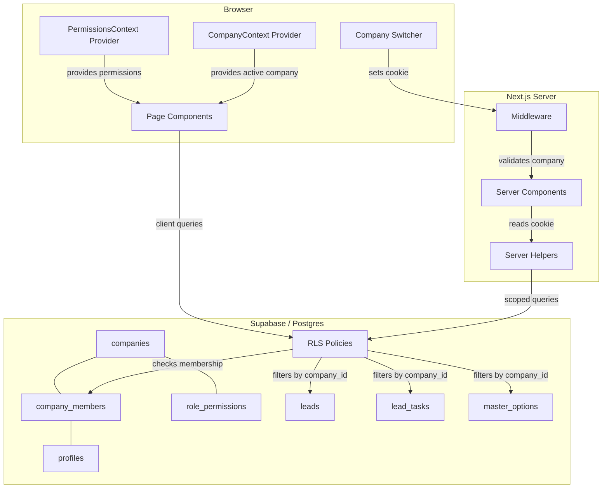
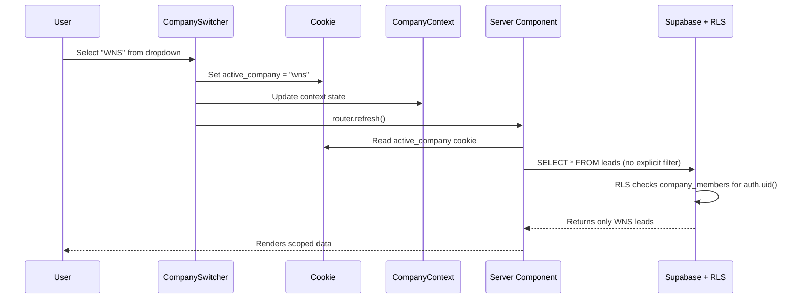
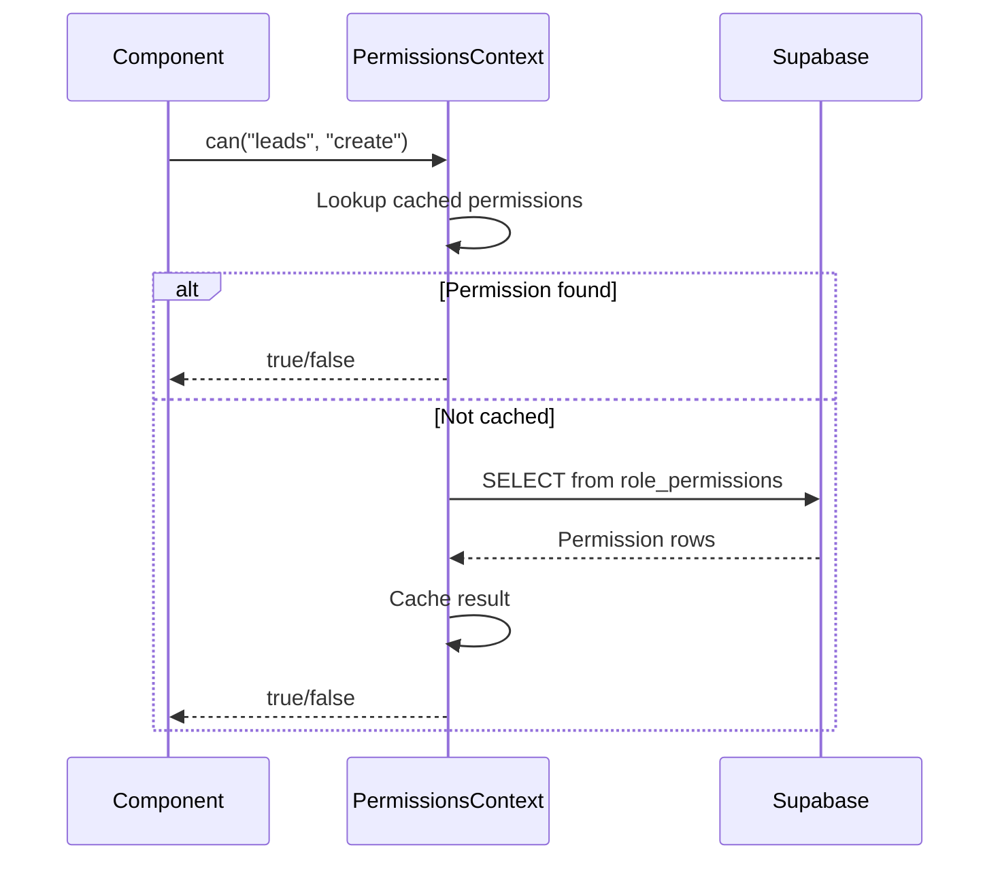

# Design: Multi-Company Support

## Overview

This feature transforms LeadEngine from a single-tenant application into a multi-tenant system where the Werkudara Group holding company and its subsidiaries each operate in isolated data spaces. The core mechanism is a `company_id` foreign key added to all tenant-scoped tables (`leads`, `lead_tasks`, `master_options`), enforced by Postgres Row Level Security (RLS) policies that check the authenticated user's company memberships.

Users interact with one company at a time via an "active company" context stored in a cookie. A special `"holding"` value enables cross-company aggregate views for holding-level users. A company switcher in the sidebar lets users toggle between companies they belong to.

The permissions model introduces a `role_permissions` table that maps `(company_id, user_type, resource, action)` → `is_allowed`, giving each company independent control over what each user type can do. A matrix UI at `/settings/companies/[slug]/permissions` lets admins toggle permissions visually.

### Key Design Decisions

1. **Cookie-based company context** over URL-based (e.g., `/company/wnw/leads`) — avoids rewriting all routes and keeps the existing URL structure intact. The cookie is read server-side via `cookies()` and client-side via React context.

2. **RLS as the primary access control layer** — all tenant isolation happens at the database level. Even if application code has a bug, Postgres prevents cross-tenant data leaks. The application layer adds the company filter for performance (avoids full table scans), but RLS is the safety net.

3. **Holding view via RLS expansion** — when a user is a member of the holding company (`is_holding = true`), the RLS policy grants access to all companies. The app sets the cookie to `"holding"` and omits the `company_id` filter, letting RLS handle the scoping.

4. **Migration-first approach** — existing data gets assigned to a default company created during migration. `company_id` columns are added as nullable first, backfilled, then set to `NOT NULL`.

5. **Permission defaults to deny** — if no `role_permissions` row exists for a `(company_id, user_type, resource, action)` tuple, access is denied. This is the safest default for a multi-tenant system.

---

## Architecture



### Data Flow: Company Switch



### Data Flow: Permission Check



---

## Components and Interfaces

### New Database Tables

#### `companies`
Central registry of all companies in the system.

#### `company_members`
Junction table linking profiles to companies with a user type.

#### `role_permissions`
Granular permission definitions per company and user type.

### New React Contexts

#### `CompanyProvider` (`src/contexts/company-context.tsx`)
- Wraps the app in `layout.tsx`
- Provides: `activeCompany`, `companies`, `switchCompany()`, `isHoldingView`
- Reads initial state from server-side props (cookie value + company list)
- `switchCompany(slug)` sets the cookie and calls `router.refresh()`

#### `PermissionsProvider` (`src/contexts/permissions-context.tsx`)
- Nested inside `CompanyProvider`
- Provides: `can(resource, action)`, `permissions`, `loading`
- Fetches `role_permissions` for the user's `user_type` in the active company
- Caches permissions in state; re-fetches on company switch

### New Components

| Component | Path | Type | Purpose |
|---|---|---|---|
| `CompanySwitcher` | `src/components/layout/company-switcher.tsx` | Client | Dropdown in sidebar for switching active company |
| `CompanyManagementPage` | `src/app/settings/companies/page.tsx` | Client | CRUD list of companies |
| `CompanyForm` | `src/components/company-form.tsx` | Client | Create/edit company dialog with name, slug, is_holding |
| `CompanyMembersPage` | `src/app/settings/companies/[slug]/members/page.tsx` | Client | Member list with add/remove/change user type |
| `PermissionsMatrixPage` | `src/app/settings/companies/[slug]/permissions/page.tsx` | Client | Matrix UI for toggling role_permissions |
| `PermissionGate` | `src/components/permission-gate.tsx` | Client | Wrapper that conditionally renders children based on `can()` |

### Updated Components

| Component | Change |
|---|---|
| `Sidebar` | Add `CompanySwitcher` below the header logo area |
| `MainLayout` | Wrap children with `CompanyProvider` and `PermissionsProvider` |
| `layout.tsx` | Pass server-side company context (from cookie) as props to providers |
| `page.tsx` (home) | Read active company from cookie, scope lead query |
| `use-master-options.ts` | Accept `companyId` param, filter by `company_id` |
| `lead-dashboard.tsx` | No change needed — data already scoped by server component |
| `task-board.tsx` | No change needed — data already scoped by server component |

### Server Utilities

#### `getActiveCompany(cookieStore)` (`src/utils/company.ts`)
Reads the `active_company` cookie, validates the user is a member, returns `{ id, slug, name, isHolding }` or falls back to the user's first company.

#### `scopedQuery(supabase, table, companyId)` (`src/utils/supabase/scoped-query.ts`)
Helper that applies `.eq('company_id', companyId)` to a Supabase query builder unless `companyId` is `null` (holding view). Returns the query builder for chaining.

---

## Data Models

### `companies` Table

```sql
CREATE TABLE public.companies (
  id uuid DEFAULT gen_random_uuid() PRIMARY KEY,
  created_at timestamptz DEFAULT now() NOT NULL,
  updated_at timestamptz DEFAULT now() NOT NULL,
  name text NOT NULL,
  slug text NOT NULL UNIQUE,
  is_holding boolean DEFAULT false NOT NULL,
  logo_url text
);

CREATE INDEX idx_companies_slug ON public.companies(slug);
```

### `company_members` Table

```sql
CREATE TABLE public.company_members (
  id uuid DEFAULT gen_random_uuid() PRIMARY KEY,
  created_at timestamptz DEFAULT now() NOT NULL,
  company_id uuid NOT NULL REFERENCES public.companies(id) ON DELETE CASCADE,
  user_id uuid NOT NULL REFERENCES public.profiles(id) ON DELETE CASCADE,
  user_type text NOT NULL DEFAULT 'staff'
    CHECK (user_type IN ('staff', 'leader', 'executive', 'admin', 'super_admin')),
  UNIQUE (company_id, user_id)
);

CREATE INDEX idx_company_members_user ON public.company_members(user_id);
CREATE INDEX idx_company_members_company ON public.company_members(company_id);
```

### `role_permissions` Table

```sql
CREATE TABLE public.role_permissions (
  id uuid DEFAULT gen_random_uuid() PRIMARY KEY,
  created_at timestamptz DEFAULT now() NOT NULL,
  company_id uuid NOT NULL REFERENCES public.companies(id) ON DELETE CASCADE,
  user_type text NOT NULL
    CHECK (user_type IN ('staff', 'leader', 'executive', 'admin', 'super_admin')),
  resource text NOT NULL,   -- e.g. 'leads', 'lead_tasks', 'master_options', 'companies', 'members'
  action text NOT NULL,     -- e.g. 'create', 'read', 'update', 'delete'
  is_allowed boolean DEFAULT false NOT NULL,
  UNIQUE (company_id, user_type, resource, action)
);

CREATE INDEX idx_role_permissions_lookup
  ON public.role_permissions(company_id, user_type);
```

### Schema Changes to Existing Tables

#### `leads` — add `company_id`

```sql
ALTER TABLE public.leads
  ADD COLUMN company_id uuid REFERENCES public.companies(id);

-- Backfill with default company (run after creating default company)
-- UPDATE public.leads SET company_id = '<default_company_uuid>';

-- Then enforce NOT NULL
-- ALTER TABLE public.leads ALTER COLUMN company_id SET NOT NULL;

CREATE INDEX idx_leads_company ON public.leads(company_id);
```

#### `lead_tasks` — add `company_id`

```sql
ALTER TABLE public.lead_tasks
  ADD COLUMN company_id uuid REFERENCES public.companies(id);

-- Backfill, then enforce NOT NULL (same pattern as leads)

CREATE INDEX idx_lead_tasks_company ON public.lead_tasks(company_id);
```

#### `master_options` — add `company_id` (nullable for global options)

```sql
ALTER TABLE public.master_options
  ADD COLUMN company_id uuid REFERENCES public.companies(id);

-- Nullable: NULL means global option available to all companies

CREATE INDEX idx_master_options_company ON public.master_options(company_id);
```

### RLS Policies

#### Helper Function: Get User's Company IDs

```sql
CREATE OR REPLACE FUNCTION public.fn_user_company_ids()
RETURNS uuid[] AS $$
  SELECT COALESCE(
    array_agg(cm.company_id),
    '{}'::uuid[]
  )
  FROM public.company_members cm
  WHERE cm.user_id = auth.uid();
$$ LANGUAGE sql STABLE SECURITY DEFINER;

CREATE OR REPLACE FUNCTION public.fn_user_has_holding_access()
RETURNS boolean AS $$
  SELECT EXISTS (
    SELECT 1
    FROM public.company_members cm
    JOIN public.companies c ON c.id = cm.company_id
    WHERE cm.user_id = auth.uid() AND c.is_holding = true
  );
$$ LANGUAGE sql STABLE SECURITY DEFINER;
```

#### Leads RLS (replace existing permissive policy)

```sql
-- Drop old permissive policy
DROP POLICY IF EXISTS "Allow public access to leads" ON public.leads;

-- SELECT: user's companies OR holding access
CREATE POLICY "leads_select_policy" ON public.leads FOR SELECT
  USING (
    company_id = ANY(public.fn_user_company_ids())
    OR public.fn_user_has_holding_access()
  );

-- INSERT: must be member of target company
CREATE POLICY "leads_insert_policy" ON public.leads FOR INSERT
  WITH CHECK (
    company_id = ANY(public.fn_user_company_ids())
  );

-- UPDATE: must be member of target company
CREATE POLICY "leads_update_policy" ON public.leads FOR UPDATE
  USING (company_id = ANY(public.fn_user_company_ids()))
  WITH CHECK (company_id = ANY(public.fn_user_company_ids()));

-- DELETE: must be member of target company
CREATE POLICY "leads_delete_policy" ON public.leads FOR DELETE
  USING (company_id = ANY(public.fn_user_company_ids()));
```

#### Lead Tasks RLS (same pattern)

```sql
DROP POLICY IF EXISTS "Allow public access to lead_tasks" ON public.lead_tasks;

CREATE POLICY "lead_tasks_select_policy" ON public.lead_tasks FOR SELECT
  USING (
    company_id = ANY(public.fn_user_company_ids())
    OR public.fn_user_has_holding_access()
  );

CREATE POLICY "lead_tasks_insert_policy" ON public.lead_tasks FOR INSERT
  WITH CHECK (company_id = ANY(public.fn_user_company_ids()));

CREATE POLICY "lead_tasks_update_policy" ON public.lead_tasks FOR UPDATE
  USING (company_id = ANY(public.fn_user_company_ids()))
  WITH CHECK (company_id = ANY(public.fn_user_company_ids()));

CREATE POLICY "lead_tasks_delete_policy" ON public.lead_tasks FOR DELETE
  USING (company_id = ANY(public.fn_user_company_ids()));
```

#### Master Options RLS

```sql
DROP POLICY IF EXISTS "Allow public access to master_options" ON public.master_options;

-- SELECT: company-specific OR global (company_id IS NULL)
CREATE POLICY "master_options_select_policy" ON public.master_options FOR SELECT
  USING (
    company_id IS NULL
    OR company_id = ANY(public.fn_user_company_ids())
    OR public.fn_user_has_holding_access()
  );

CREATE POLICY "master_options_insert_policy" ON public.master_options FOR INSERT
  WITH CHECK (
    company_id IS NULL
    OR company_id = ANY(public.fn_user_company_ids())
  );

CREATE POLICY "master_options_update_policy" ON public.master_options FOR UPDATE
  USING (company_id IS NULL OR company_id = ANY(public.fn_user_company_ids()))
  WITH CHECK (company_id IS NULL OR company_id = ANY(public.fn_user_company_ids()));
```

#### Company Members RLS

```sql
ALTER TABLE public.company_members ENABLE ROW LEVEL SECURITY;

-- SELECT: can see members of companies you belong to
CREATE POLICY "company_members_select_policy" ON public.company_members FOR SELECT
  USING (
    company_id = ANY(public.fn_user_company_ids())
    OR public.fn_user_has_holding_access()
  );

-- INSERT/UPDATE/DELETE: admin or super_admin of that company
CREATE POLICY "company_members_manage_policy" ON public.company_members
  FOR ALL
  USING (
    EXISTS (
      SELECT 1 FROM public.company_members cm
      WHERE cm.user_id = auth.uid()
        AND cm.company_id = company_members.company_id
        AND cm.user_type IN ('admin', 'super_admin')
    )
  )
  WITH CHECK (
    EXISTS (
      SELECT 1 FROM public.company_members cm
      WHERE cm.user_id = auth.uid()
        AND cm.company_id = company_members.company_id
        AND cm.user_type IN ('admin', 'super_admin')
    )
  );
```

#### Companies RLS

```sql
ALTER TABLE public.companies ENABLE ROW LEVEL SECURITY;

-- SELECT: can see companies you're a member of (or all if holding)
CREATE POLICY "companies_select_policy" ON public.companies FOR SELECT
  USING (
    id = ANY(public.fn_user_company_ids())
    OR public.fn_user_has_holding_access()
  );

-- INSERT/UPDATE/DELETE: super_admin of holding company only
CREATE POLICY "companies_manage_policy" ON public.companies
  FOR ALL
  USING (
    EXISTS (
      SELECT 1 FROM public.company_members cm
      JOIN public.companies c ON c.id = cm.company_id
      WHERE cm.user_id = auth.uid()
        AND c.is_holding = true
        AND cm.user_type = 'super_admin'
    )
  )
  WITH CHECK (
    EXISTS (
      SELECT 1 FROM public.company_members cm
      JOIN public.companies c ON c.id = cm.company_id
      WHERE cm.user_id = auth.uid()
        AND c.is_holding = true
        AND cm.user_type = 'super_admin'
    )
  );
```

#### Role Permissions RLS

```sql
ALTER TABLE public.role_permissions ENABLE ROW LEVEL SECURITY;

-- SELECT: members of the company can read permissions
CREATE POLICY "role_permissions_select_policy" ON public.role_permissions FOR SELECT
  USING (
    company_id = ANY(public.fn_user_company_ids())
    OR public.fn_user_has_holding_access()
  );

-- Manage: admin or super_admin of that company
CREATE POLICY "role_permissions_manage_policy" ON public.role_permissions
  FOR ALL
  USING (
    EXISTS (
      SELECT 1 FROM public.company_members cm
      WHERE cm.user_id = auth.uid()
        AND cm.company_id = role_permissions.company_id
        AND cm.user_type IN ('admin', 'super_admin')
    )
  )
  WITH CHECK (
    EXISTS (
      SELECT 1 FROM public.company_members cm
      WHERE cm.user_id = auth.uid()
        AND cm.company_id = role_permissions.company_id
        AND cm.user_type IN ('admin', 'super_admin')
    )
  );
```

### TypeScript Types

```typescript
// src/types/company.ts

export interface Company {
  id: string
  created_at: string
  updated_at: string
  name: string
  slug: string
  is_holding: boolean
  logo_url: string | null
}

export type CompanyInsert = Omit<Company, 'id' | 'created_at' | 'updated_at'>
export type CompanyUpdate = Partial<CompanyInsert>

export type UserType = 'staff' | 'leader' | 'executive' | 'admin' | 'super_admin'

export interface CompanyMember {
  id: string
  created_at: string
  company_id: string
  user_id: string
  user_type: UserType
  // Joined data
  profiles?: {
    full_name: string | null
    email: string | null
    avatar_url: string | null
  }
  companies?: {
    name: string
    slug: string
    is_holding: boolean
  }
}

export interface RolePermission {
  id: string
  created_at: string
  company_id: string
  user_type: UserType
  resource: string
  action: string
  is_allowed: boolean
}

export interface CompanyContext {
  id: string
  slug: string
  name: string
  isHolding: boolean
}

export interface ActiveCompanyState {
  activeCompany: CompanyContext | null
  companies: CompanyContext[]
  isHoldingView: boolean
  switchCompany: (slug: string) => void
}
```

### Migration Strategy

The migration runs in a single SQL file (`supabase/migration_multi_company.sql`) with these ordered steps:

1. **Create `companies` table** and insert the default Werkudara Group holding company
2. **Create `company_members` table**
3. **Create `role_permissions` table**
4. **Add `company_id` to `leads`** (nullable), backfill with default company ID, set `NOT NULL`
5. **Add `company_id` to `lead_tasks`** (nullable), backfill with default company ID, set `NOT NULL`
6. **Add `company_id` to `master_options`** (nullable), backfill with default company ID (keep nullable for global options)
7. **Migrate existing profiles** to `company_members` with user type mapping:
   - `super_admin` → `super_admin`
   - `director` → `executive`
   - `bu_manager` → `leader`
   - `sales` → `staff`
   - `finance` → `staff`
8. **Drop old permissive RLS policies** and create new company-scoped policies
9. **Seed default `role_permissions`** for the default company with sensible defaults per user type
10. **Create indexes** on all new `company_id` columns

