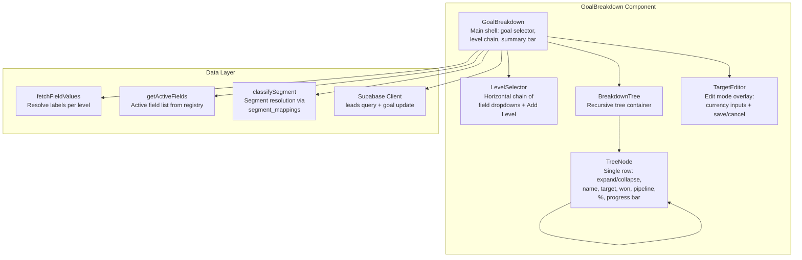

# Design: Multi-Level Goal Breakdown

## Overview

This design specifies the technical approach for upgrading the Goal Breakdown component (`src/features/goals/components/settings/goal-breakdown.tsx`) from a single-level flat table to a multi-level hierarchical tree view. The admin defines an ordered chain of up to 3 breakdown levels (e.g., Client Company → Line Industry → Sales Owner), and the component renders an expandable/collapsible tree where each node shows target, won revenue, pipeline value, attainment percentage, and a progress bar.

Key design decisions:

- **No new DB tables** — the existing `breakdown_targets` JSONB column on the `goals` table stores both the level configuration (`levels` array) and the nested target structure (`targets` object).
- **Rewrite in-place** — the existing `GoalBreakdown` component is rewritten to support multi-level trees while preserving single-level backward compatibility.
- **Recursive TreeNode component** — a `TreeNode` component renders itself for children, supporting arbitrary depth up to 3 levels.
- **Fetch-once, group client-side** — all leads are fetched in a single query, then grouped into the tree hierarchy client-side for performance. Child groupings are computed lazily when a parent node is expanded.
- **Value resolution via existing utilities** — `fetchFieldValues()` and `getActiveFields()` from `src/utils/field-values.ts` resolve labels for each level. Analytical Dimensions are resolved through existing `segment_mappings`.
- **Backward compatible** — when `levels` is absent or has length ≤ 1, the component falls back to the existing flat table behavior using the legacy `breakdown_field` and `by_{field}` keys.

## Architecture

### Component Architecture



### Data Flow

1. Admin selects/configures breakdown levels via `LevelSelector`
2. Component fetches all leads matching the goal's company in a single Supabase query
3. For each level, `fetchFieldValues()` pre-populates all possible values (ensuring nodes appear even with 0 leads)
4. Leads are grouped into a tree structure client-side using the ordered level keys
5. When a parent node is expanded, its children are computed by filtering the parent's lead subset and grouping by the next level's field
6. Won revenue and pipeline values aggregate bottom-up: leaf nodes sum their matching leads, parent nodes sum their children
7. Targets are stored in a nested JSONB structure and edited inline

## Components and Interfaces

### Component Hierarchy

```
GoalBreakdown (main shell)
├── Goal selector dropdown (when multiple goals)
├── LevelSelector
│   ├── LevelDropdown × N (field selector per level)
│   ├── Arrow indicators between levels
│   ├── Add Level button (hidden at max 3)
│   └── Remove button (× on hover per level)
├── Summary bar (total target, won, attainment %)
├── BreakdownTree / flat Table (based on level count)
│   └── TreeNode (recursive)
│       ├── Expand/collapse toggle (▶/▼)
│       ├── Indented name label
│       ├── Target (display or CurrencyInput in edit mode)
│       ├── Won Revenue
│       ├── Pipeline Value
│       ├── % of Target
│       ├── Progress bar
│       ├── Over/under indicator (edit mode, parent nodes)
│       └── TreeNode children (when expanded)
└── Edit Targets bar (save/cancel + sub-target total)
```

### New/Modified Files

| File | Action | Description |
|---|---|---|
| `src/features/goals/components/settings/goal-breakdown.tsx` | Rewrite | Multi-level tree with recursive TreeNode |
| `src/features/goals/lib/breakdown-utils.ts` | New | Pure utility functions: tree building, aggregation, target serialization |

### Key Interfaces

```typescript
// ── Level Configuration ──

interface BreakdownLevel {
  fieldKey: string        // Lead field key or "segment:{dimensionId}"
  label: string           // Display label from registry or dimension name
}

// ── Tree Data Structure ──

interface TreeNodeData {
  id: string              // Field value (company ID, option value, segment name, etc.)
  name: string            // Display label resolved from source
  level: number           // 0-indexed depth in the tree
  fieldKey: string        // Which field this node represents
  wonRevenue: number      // Sum of actual_value for closed-won leads
  pipelineValue: number   // Sum of estimated_value for open leads
  target: number          // Persisted target amount for this node
  children: TreeNodeData[] | null  // null = not yet computed (lazy), [] = leaf
  leadIds: number[]       // Lead IDs that belong to this node (for child grouping)
}

// ── Persisted JSONB Structure (breakdown_targets column) ──

interface MultiLevelBreakdownTargets {
  levels: string[]        // Ordered field keys, e.g. ["client_company_id", "line_industry"]
  targets: NestedTargets  // Hierarchical target amounts
  // Legacy keys preserved for backward compat:
  breakdown_field?: string
  [byFieldKey: string]: unknown  // e.g. by_client_company_id: { "uuid1": 50000 }
}

interface NestedTargets {
  [fieldValue: string]: {
    _target: number
    [childFieldValue: string]: { _target: number; [key: string]: unknown } | number
  }
}
```

### Pure Utility Functions (`breakdown-utils.ts`)

```typescript
// Build the initial tree from leads + level config
function buildBreakdownTree(
  leads: LeadRow[],
  levels: BreakdownLevel[],
  valueMaps: Map<string, Map<string, string>>,  // fieldKey → (value → label)
  segmentResolver: (fieldKey: string, rawValue: string) => string,
  savedTargets: NestedTargets
): TreeNodeData[]

// Compute children for a specific parent node (lazy expansion)
function computeChildren(
  parentNode: TreeNodeData,
  allLeads: LeadRow[],
  levels: BreakdownLevel[],
  currentLevelIndex: number,
  valueMaps: Map<string, Map<string, string>>,
  segmentResolver: (fieldKey: string, rawValue: string) => string,
  savedTargets: NestedTargets
): TreeNodeData[]

// Aggregate won/pipeline values bottom-up
function aggregateNode(node: TreeNodeData): { wonRevenue: number; pipelineValue: number }

// Serialize tree targets to nested JSONB format
function serializeTargets(
  nodes: TreeNodeData[],
  levels: BreakdownLevel[]
): NestedTargets

// Deserialize nested JSONB targets back to per-node target map
function deserializeTargets(
  targets: NestedTargets,
  path: string[]
): number

// Validate that a field is not already used in the level chain
function isFieldAvailable(
  fieldKey: string,
  currentLevels: BreakdownLevel[]
): boolean

// Resolve a lead's field value for a given level (handles segment: prefix)
function resolveLeadValue(
  lead: LeadRow,
  level: BreakdownLevel,
  segmentResolver: (fieldKey: string, rawValue: string) => string
): { key: string; label: string }
```

### Component Props

```typescript
// GoalBreakdown — same external interface, internal rewrite
interface GoalBreakdownProps {
  goals: Goal[]
  onGoalsChange?: () => void
}

// TreeNode — recursive internal component
interface TreeNodeProps {
  node: TreeNodeData
  levels: BreakdownLevel[]
  editing: boolean
  editTargets: Map<string, number>  // path-key → target amount
  onToggleExpand: (node: TreeNodeData) => void
  onTargetChange: (pathKey: string, value: number) => void
  depth: number
}
```

## Data Models

### Breakdown Targets JSONB Schema

The `breakdown_targets` column on the `goals` table stores the multi-level configuration. No schema migration is needed — the column already exists as `jsonb`.

#### Multi-Level Format (new)

```json
{
  "levels": ["client_company_id", "line_industry", "pic_sales_id"],
  "targets": {
    "company-uuid-1": {
      "_target": 500000000,
      "Banking": {
        "_target": 300000000,
        "sales-uuid-1": { "_target": 200000000 },
        "sales-uuid-2": { "_target": 100000000 }
      },
      "Technology": {
        "_target": 200000000,
        "sales-uuid-1": { "_target": 200000000 }
      }
    },
    "company-uuid-2": {
      "_target": 250000000,
      "Insurance": {
        "_target": 250000000,
        "sales-uuid-3": { "_target": 250000000 }
      }
    }
  }
}
```

#### Single-Level Format (legacy, preserved)

```json
{
  "breakdown_field": "client_company_id",
  "by_client_company_id": {
    "company-uuid-1": 500000000,
    "company-uuid-2": 250000000
  }
}
```

#### Backward Compatibility Rules

| Condition | Behavior |
|---|---|
| `levels` absent or `levels.length === 0` | Check for legacy `breakdown_field` key, render flat table |
| `levels.length === 1` | Render flat table (same as legacy) |
| `levels.length >= 2` | Render hierarchical tree |
| Legacy `by_{field}` keys present alongside `levels` | Ignored when `levels` exists; preserved on write for safety |

### Lead Query Shape

A single query fetches all leads for the goal's company with the fields needed for all possible breakdown levels:

```typescript
const selectStr = `
  id, actual_value, estimated_value,
  pipeline_stage:pipeline_stages!pipeline_stage_id (stage_type, closed_status),
  client_company_id, client_company:client_companies!client_company_id (id, name, line_industry),
  pic_sales_id, pic_sales_profile:profiles!pic_sales_id (id, full_name),
  category, lead_source, main_stream, grade_lead, stream_type,
  business_purpose, tipe, nationality, sector, area, referral_source, event_format
`
```

This fetches all 15 registry fields plus joined relations in one query. The client-side grouping logic then uses whichever fields the configured levels reference.

### Value Resolution Strategy

| ValueSource Type | Key | Label |
|---|---|---|
| `client_companies` | `client_company.id` | `client_company.name` |
| `profiles` | `pic_sales_id` | `pic_sales_profile.full_name` |
| `master_options` | option `value` | option `label` |
| `client_company_field` | `client_company[column]` | raw value |
| `leads_distinct` | raw field value | raw field value |
| `segment:{dimId}` | resolved segment name | segment name |

For each level, `fetchFieldValues()` is called once to build a complete value→label map. This ensures tree nodes appear even when no leads match a particular value.


## Correctness Properties

*A property is a characteristic or behavior that should hold true across all valid executions of a system — essentially, a formal statement about what the system should do. Properties serve as the bridge between human-readable specifications and machine-verifiable correctness guarantees.*

### Property 1: Field uniqueness in level chain

*For any* breakdown structure of N levels (1 ≤ N ≤ 10) and any field key already present in the structure, `isFieldAvailable(fieldKey, currentLevels)` SHALL return `false`, ensuring no field appears more than once in the level chain.

**Validates: Requirements 1.6**

### Property 2: Level removal truncation

*For any* breakdown structure of N levels and any removal index i (0 ≤ i < N), removing level i SHALL produce a structure containing exactly the first i levels, preserving their original order.

**Validates: Requirements 1.7**

### Property 3: Leaf node aggregation correctness

*For any* set of leads and any multi-level breakdown structure, each leaf node's won revenue SHALL equal the sum of `actual_value` for all closed-won leads whose field values match the complete path from root to that leaf, and its pipeline value SHALL equal the sum of `estimated_value` for all non-lost open leads matching the same path.

**Validates: Requirements 3.1**

### Property 4: Parent-child aggregation invariant

*For any* tree produced by `buildBreakdownTree`, every parent node's `wonRevenue` SHALL equal the sum of its direct children's `wonRevenue`, and every parent node's `pipelineValue` SHALL equal the sum of its direct children's `pipelineValue`.

**Validates: Requirements 3.2**

### Property 5: Revenue conservation

*For any* set of leads and any breakdown structure, the sum of all level-0 (top-level) tree nodes' `wonRevenue` SHALL equal the total won revenue computed directly from the leads, ensuring no leads are lost or double-counted during tree construction.

**Validates: Requirements 3.3**

### Property 6: Null field values classified as Unassigned

*For any* lead whose field value is null or empty string for a given breakdown level, that lead SHALL be grouped under a tree node with the name "Unassigned" at that level.

**Validates: Requirements 3.4**

### Property 7: Segment resolution with fallback

*For any* lead and any breakdown level referencing an Analytical Dimension, the lead SHALL be assigned to the segment whose `match_values` contain the lead's raw field value (first match by priority order), or to the dimension's `fallback_segment_name` if no mapping matches.

**Validates: Requirements 3.5**

### Property 8: Target serialization round-trip

*For any* valid tree of target amounts across N levels, serializing the targets to the `NestedTargets` JSONB format via `serializeTargets` and then deserializing back via `deserializeTargets` SHALL produce the same target value for every node path.

**Validates: Requirements 4.4, 5.1, 5.2**

### Property 9: Backward compatibility parsing

*For any* legacy `breakdown_targets` JSONB object containing a `breakdown_field` key and a `by_{field}` map (without a `levels` array), the component SHALL correctly parse it into a single-level flat breakdown with the same field and target values.

**Validates: Requirements 5.3**

### Property 10: Pre-population completeness

*For any* set of possible field values (from `fetchFieldValues`) and any set of leads (where some values may have no matching leads), the resulting tree level SHALL contain a node for every possible value, including those with zero won revenue and zero pipeline value.

**Validates: Requirements 6.7**

### Property 11: Sort order invariant

*For any* set of tree nodes at a given level, the nodes SHALL be sorted by `wonRevenue` in descending order.

**Validates: Requirements 7.6**

## Error Handling

| Scenario | Handling |
|---|---|
| `fetchFieldValues()` returns empty array for a level | Level renders with only "Unassigned" node (from leads with values not in the empty set) |
| Lead query fails (Supabase error) | Show existing pre-populated nodes with zero values; display toast error |
| `breakdown_targets` JSONB is null or malformed | Default to empty levels array and empty targets; show "Add a level" prompt |
| Segment dimension referenced in levels is deleted | Level shows raw field values instead of segment names; log warning |
| `updateGoalAction` fails on save | Show toast error, keep edit mode active with unsaved changes |
| Circular or invalid level configuration | `isFieldAvailable` prevents duplicates; max 3 levels enforced in UI |
| Lead has no `pipeline_stage` join (orphaned stage) | Treat as open pipeline (not won, not lost) |
| Very large number of leads (>10k) | Single query + client-side grouping; no pagination needed since grouping reduces to distinct values per level |

## Testing Strategy

### Unit Tests (Example-Based)

Focus on specific scenarios and edge cases:

- Render with 0 levels → shows "add a level" prompt
- Render with 1 level → flat table (backward compat)
- Render with 2+ levels → tree with expand/collapse
- Expand/collapse toggle changes indicator (▶/▼)
- Edit mode shows CurrencyInput for all nodes
- Cancel edit restores original values
- Save with mismatched totals shows warning
- Over/under indicator displays correct amount
- Level selector excludes already-selected fields
- Add Level button hidden at max 3 levels
- Value resolution for each `valueSource` type (client_companies, profiles, master_options, client_company_field, leads_distinct, segment)

### Property-Based Tests

Using `fast-check` for TypeScript property-based testing. Each test runs minimum 100 iterations.

| Property | Test Target | Generator Strategy |
|---|---|---|
| Property 1: Field uniqueness | `isFieldAvailable()` | Random subsets of LEAD_FIELD_REGISTRY keys |
| Property 2: Level removal | Level array manipulation | Random arrays of 1-3 field keys + random removal index |
| Property 3: Leaf aggregation | `buildBreakdownTree()` | Random leads with random field values, random 1-3 level configs |
| Property 4: Parent-child invariant | `aggregateNode()` | Random tree structures with random revenue values |
| Property 5: Revenue conservation | `buildBreakdownTree()` | Same generator as Property 3 |
| Property 6: Null → Unassigned | `resolveLeadValue()` | Random leads with null/empty fields |
| Property 7: Segment resolution | `resolveLeadValue()` with segments | Random dimensions, mappings, and lead values |
| Property 8: Serialization round-trip | `serializeTargets()` + `deserializeTargets()` | Random nested target trees up to 3 levels deep |
| Property 9: Backward compat | Legacy JSONB parsing | Random legacy `breakdown_field` + `by_{field}` structures |
| Property 10: Pre-population | `buildBreakdownTree()` | Random possible values superset + random leads subset |
| Property 11: Sort order | Tree node sorting | Random arrays of TreeNodeData with random wonRevenue |

Each property test is tagged with: `Feature: multi-level-breakdown, Property {N}: {title}`

### Integration Tests

- End-to-end: configure 2-level breakdown → expand nodes → edit targets → save → reload → verify persisted structure
- Verify `updateGoalAction` is called with correct JSONB shape
- Verify segment-level breakdown resolves through actual `segment_mappings` data
