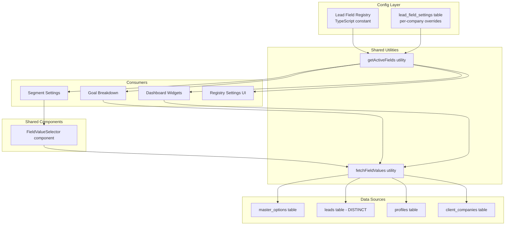

# Design: Settings Interconnection & UX Redesign

## Overview

This design addresses the fragmentation between LeadEngine's settings modules by introducing a Lead Field Registry as the single source of truth for analyzable lead fields, promoting segments to a global settings concept, and rewiring goal breakdown, segment mapping, and dashboard widgets to consume interconnected data.

The core insight is that LeadEngine already has the data infrastructure (master_options, analytical_dimensions, segment_mappings, profiles, client_companies) — what's missing is a unifying registry that tells the system "these are the fields you can analyze" and a shared UI component that fetches values from the right source.

### Key Design Decisions

1. **Lead Field Registry as TypeScript config constant** — The lead schema is known and stable (15 core fields). A DB table adds migration/admin overhead without V1 benefit. The registry is a typed constant in `src/config/lead-field-registry.ts` with an `is_active` flag stored per-company in a `lead_field_settings` table for admin overrides.

2. **Value fetching via a unified `fetchFieldValues()` utility** — A single async function that switches on `ValueSource` type to query the correct table. Used by both the Field Value Selector component and the Goal Breakdown component.

3. **Field Value Selector as a shared component** — A `FieldValueSelector` component in `src/components/shared/` that replaces the TagInput in segment mapping forms and is reused anywhere values need to be selected from existing data.

4. **Global Segments page at `/settings/segments`** — Segments are promoted from the Goal Settings accordion to a dedicated settings route. The Goal Settings accordion removes its embedded Segments section and links to the global page.

5. **Goal Breakdown rewrite** — The current hardcoded `BreakdownMode = "company" | "sales_owner"` is replaced with a dynamic field selector driven by the registry. The `breakdown_targets` JSONB structure on the `goals` table is extended to support any field key.

6. **Dashboard widget integration** — The existing `catToggle` and `streamToggle` patterns in `analytics-dashboard.tsx` are extended to read available fields from the registry, with current toggles as defaults for backward compatibility.

## Architecture



### Data Flow

1. **Registry resolution**: `getActiveFields(companyId)` merges the static registry with per-company `lead_field_settings` overrides to produce the active field list.
2. **Value fetching**: When a consumer needs values for a field, it calls `fetchFieldValues(fieldKey, companyId)` which reads the registry entry's `valueSource` and queries the appropriate table.
3. **Segment resolution**: Unchanged — the existing `classifyLead()` engine in `classification-engine.ts` continues to resolve segments via `analytical_dimensions` + `segment_mappings`. The only change is that the dimension's `source_field` now comes from the registry instead of a hardcoded list.

## Components and Interfaces

### 1. Lead Field Registry Config (`src/config/lead-field-registry.ts`)

```typescript
export type ValueSource =
  | { type: 'master_options'; optionType: string }
  | { type: 'leads_distinct'; column: string }
  | { type: 'profiles' }
  | { type: 'client_companies' }

export interface LeadFieldEntry {
  key: string                    // e.g. "category", "pic_sales_id"
  label: string                  // e.g. "Category", "Sales Owner"
  valueSource: ValueSource
  isSystemDefault: boolean       // true for the 15 core fields
  supportsSegmentation: boolean  // true for master_options and leads_distinct
}

export const LEAD_FIELD_REGISTRY: LeadFieldEntry[] = [
  { key: 'category', label: 'Category', valueSource: { type: 'master_options', optionType: 'category' }, isSystemDefault: true, supportsSegmentation: true },
  { key: 'lead_source', label: 'Lead Source', valueSource: { type: 'master_options', optionType: 'lead_source' }, isSystemDefault: true, supportsSegmentation: true },
  { key: 'main_stream', label: 'Main Stream', valueSource: { type: 'master_options', optionType: 'main_stream' }, isSystemDefault: true, supportsSegmentation: true },
  { key: 'grade_lead', label: 'Grade Lead', valueSource: { type: 'master_options', optionType: 'grade_lead' }, isSystemDefault: true, supportsSegmentation: true },
  { key: 'stream_type', label: 'Stream Type', valueSource: { type: 'master_options', optionType: 'stream_type' }, isSystemDefault: true, supportsSegmentation: true },
  { key: 'business_purpose', label: 'Business Purpose', valueSource: { type: 'master_options', optionType: 'business_purpose' }, isSystemDefault: true, supportsSegmentation: true },
  { key: 'tipe', label: 'Tipe', valueSource: { type: 'master_options', optionType: 'tipe' }, isSystemDefault: true, supportsSegmentation: true },
  { key: 'nationality', label: 'Nationality', valueSource: { type: 'master_options', optionType: 'nationality' }, isSystemDefault: true, supportsSegmentation: true },
  { key: 'sector', label: 'Sector', valueSource: { type: 'master_options', optionType: 'sector' }, isSystemDefault: true, supportsSegmentation: true },
  { key: 'line_industry', label: 'Line Industry', valueSource: { type: 'master_options', optionType: 'line_industry' }, isSystemDefault: true, supportsSegmentation: true },
  { key: 'area', label: 'Area', valueSource: { type: 'master_options', optionType: 'area' }, isSystemDefault: true, supportsSegmentation: true },
  { key: 'referral_source', label: 'Referral Source', valueSource: { type: 'leads_distinct', column: 'referral_source' }, isSystemDefault: true, supportsSegmentation: true },
  { key: 'event_format', label: 'Event Format', valueSource: { type: 'master_options', optionType: 'event_format' }, isSystemDefault: true, supportsSegmentation: true },
  { key: 'pic_sales_id', label: 'Sales Owner', valueSource: { type: 'profiles' }, isSystemDefault: true, supportsSegmentation: false },
  { key: 'client_company_id', label: 'Client Company', valueSource: { type: 'client_companies' }, isSystemDefault: true, supportsSegmentation: false },
]
```

### 2. Field Value Fetcher (`src/utils/field-values.ts`)

```typescript
export interface FieldValue {
  id: string       // unique identifier (option id, profile id, company id, or raw value)
  label: string    // display label
  value: string    // stored value
}

export async function fetchFieldValues(
  supabase: SupabaseClient,
  fieldKey: string,
  companyId: string
): Promise<FieldValue[]>
```

Switches on the registry entry's `valueSource.type`:
- `master_options` → queries `master_options` where `option_type = valueSource.optionType` and `is_active = true`
- `leads_distinct` → queries `SELECT DISTINCT column FROM leads WHERE column IS NOT NULL`
- `profiles` → queries `profiles` joined with `company_members` for active sales-role users
- `client_companies` → queries `client_companies` for the company scope

### 3. Active Fields Resolver (`src/utils/field-values.ts`)

```typescript
export function getActiveFields(
  settings?: LeadFieldSetting[]
): LeadFieldEntry[]
```

Merges the static `LEAD_FIELD_REGISTRY` with per-company `lead_field_settings` rows. Fields without an override default to active. Returns only active fields.

### 4. FieldValueSelector Component (`src/components/shared/field-value-selector.tsx`)

A shared multi-select component that:
- Accepts a `fieldKey` and `companyId` prop
- Calls `fetchFieldValues()` on mount
- Renders a searchable, multi-select popover with checkboxes
- Shows selected values as removable tags
- Displays loading state while fetching
- Falls back to free-text input if no values are available
- Replaces the current `TagInput` in segment mapping forms

```typescript
interface FieldValueSelectorProps {
  fieldKey: string
  companyId: string
  selectedValues: string[]
  onChange: (values: string[]) => void
  placeholder?: string
  allowCustom?: boolean  // fallback to free-text if no data
}
```

### 5. Goal Breakdown Rewrite (`src/features/goals/components/settings/goal-breakdown.tsx`)

The current component has `BreakdownMode = "company" | "sales_owner"` hardcoded. The rewrite:
- Replaces the mode selector with a dropdown populated from `getActiveFields()`
- Stores the selected field key in `breakdown_targets` under a dynamic key (e.g., `by_category`, `by_line_industry`)
- Also includes segment-based breakdown options from `analytical_dimensions`
- The grouping logic switches on `valueSource.type` to determine how to group leads and resolve labels

### 6. Global Segments Page (`src/app/settings/segments/page.tsx`)

A new route that:
- Lists all `analytical_dimensions` for the active company
- Allows creating/editing/deleting dimensions and their segment mappings
- Uses `getActiveFields()` filtered to `supportsSegmentation: true` for the source field selector
- Uses `FieldValueSelector` for mapping value selection
- Reuses existing `SegmentMappingForm` and `ClassificationPreview` components from `src/features/goals/components/dimensions/`

### 7. Registry Settings UI (`src/app/settings/registry/page.tsx`)

A new route that:
- Displays all registered fields with their label, key, value source, and active status
- Allows toggling `is_active` per field (stored in `lead_field_settings` table)
- Allows adding custom fields (stored as additional entries in `lead_field_settings`)
- Warns before deactivating fields referenced by existing segments or breakdown configs
- Prevents deletion of system-default fields

### 8. Settings Landing Page Update (`src/app/settings/page.tsx`)

Updates the existing settings page to:
- Add "Lead Field Registry" and "Segments & Dimensions" module cards
- Reorder modules to reflect data dependencies
- Add dependency indicators to the Goal Settings card (e.g., "Uses: Master Options, Pipeline, Companies, Segments")

## Data Models

### Existing Tables (No Changes)

- `master_options` — continues to store dropdown values, queried by `option_type`
- `analytical_dimensions` — continues to store dimension definitions with `source_field`
- `segment_mappings` — continues to store value-to-segment mappings
- `goals` — `breakdown_targets` JSONB column already supports arbitrary keys
- `profiles` — queried for sales owner values
- `client_companies` — queried for company values

### New Table: `lead_field_settings`

Stores per-company overrides for the Lead Field Registry.

```sql
CREATE TABLE lead_field_settings (
  id UUID PRIMARY KEY DEFAULT gen_random_uuid(),
  created_at TIMESTAMPTZ NOT NULL DEFAULT now(),
  updated_at TIMESTAMPTZ NOT NULL DEFAULT now(),
  company_id UUID NOT NULL REFERENCES companies(id) ON DELETE CASCADE,
  field_key TEXT NOT NULL,
  is_active BOOLEAN NOT NULL DEFAULT true,
  custom_label TEXT,           -- override display label
  custom_value_source JSONB,   -- for custom (non-system) fields
  UNIQUE(company_id, field_key)
);

-- RLS: company-scoped read/write
ALTER TABLE lead_field_settings ENABLE ROW LEVEL SECURITY;

CREATE POLICY "Users can read own company field settings"
  ON lead_field_settings FOR SELECT
  USING (company_id IN (SELECT fn_user_company_ids()));

CREATE POLICY "Users can manage own company field settings"
  ON lead_field_settings FOR ALL
  USING (company_id IN (SELECT fn_user_company_ids()));
```

### TypeScript Types

```typescript
// src/types/index.ts additions

export interface LeadFieldSetting {
  id: string
  created_at: string
  updated_at: string
  company_id: string
  field_key: string
  is_active: boolean
  custom_label: string | null
  custom_value_source: ValueSource | null
}
```

### Updated `breakdown_targets` JSONB Structure

Currently: `{ "by_company": { "<id>": <amount> }, "by_sales_owner": { "<id>": <amount> } }`

Extended to: `{ "by_<field_key>": { "<value>": <amount> }, "breakdown_field": "<field_key>" }`

The `breakdown_field` key stores which field is currently selected for breakdown, so the UI can restore the selection on reload.


## Correctness Properties

*A property is a characteristic or behavior that should hold true across all valid executions of a system — essentially, a formal statement about what the system should do. Properties serve as the bridge between human-readable specifications and machine-verifiable correctness guarantees.*

### Property 1: Active field resolution

*For any* Lead Field Registry state and any set of per-company `lead_field_settings` overrides, `getActiveFields()` SHALL return exactly the fields where: (a) the field exists in the registry AND has no override, OR (b) the field has an override with `is_active = true`. Fields with `is_active = false` overrides SHALL be excluded. Fields with `supportsSegmentation = true` in the result SHALL be exactly those whose `valueSource.type` is `master_options` or `leads_distinct`.

**Validates: Requirements 1.8, 6.1, 6.4, 8.2**

### Property 2: Field value fetching correctness

*For any* field key registered in the Lead Field Registry and any corresponding data in the source table, `fetchFieldValues()` SHALL return values that exactly match the source: for `master_options` sources, the returned values SHALL equal the active options with matching `option_type`; for `leads_distinct` sources, the returned values SHALL equal the distinct non-null values in the corresponding leads column.

**Validates: Requirements 1.3, 1.4, 4.1, 4.2**

### Property 3: Breakdown grouping correctness

*For any* active field (or segment definition) selected as a breakdown dimension and any set of leads, the Goal Breakdown grouping SHALL produce one group per distinct value of that field across the leads, and each group's `wonRevenue` SHALL equal the sum of `actual_value` for won leads in that group, and each group's `pipelineValue` SHALL equal the sum of `estimated_value` for non-won, non-lost leads in that group. When the breakdown dimension is a segment, leads SHALL be grouped by their resolved segment name (via the existing `resolveSegment` logic) instead of raw field values.

**Validates: Requirements 2.2, 2.7, 7.2**

### Property 4: Breakdown dimension persistence round-trip

*For any* goal and any valid breakdown dimension field key, saving the breakdown dimension to `breakdown_targets` and then reading it back SHALL return the same field key. The sub-targets stored under `by_<field_key>` SHALL be preserved exactly.

**Validates: Requirements 2.8**

### Property 5: Field value search filtering

*For any* list of field values and any non-empty search string, the filtered result SHALL contain exactly those values whose label contains the search string (case-insensitive). An empty search string SHALL return all values.

**Validates: Requirements 4.4**

### Property 6: Dependency detection before deactivation

*For any* field key that is referenced as a `source_field` in an existing `analytical_dimensions` row OR as the `breakdown_field` in an existing goal's `breakdown_targets`, attempting to deactivate that field SHALL produce a warning listing the dependent configurations. The existing configurations SHALL remain unchanged regardless of whether the admin proceeds.

**Validates: Requirements 8.4**

### Property 7: System field deletion prevention

*For any* field in the Lead Field Registry where `isSystemDefault` is `true`, the system SHALL reject deletion attempts. Deactivation (setting `is_active = false`) SHALL be allowed, but the field entry SHALL remain in the registry.

**Validates: Requirements 8.5**

## Error Handling

### Field Value Fetching Errors

- **Network/DB errors during `fetchFieldValues()`**: The FieldValueSelector component displays an error message and offers a retry button. The `allowCustom` fallback enables free-text input so the admin isn't blocked.
- **Empty results**: When a field has no values in its source table, the selector shows "No values available" and falls back to free-text input if `allowCustom` is true (Requirement 4.6).
- **Invalid field key**: If `fetchFieldValues()` receives a field key not in the registry, it returns an empty array and logs a warning.

### Registry Settings Errors

- **Deactivation of referenced field**: The system checks `analytical_dimensions.source_field` and `goals.breakdown_targets` for references before deactivation. If references exist, a confirmation dialog lists the dependent configurations (Requirement 8.4).
- **Duplicate field key on custom field creation**: The `lead_field_settings` table has a UNIQUE constraint on `(company_id, field_key)`. The UI validates uniqueness before submission and shows an error if the key already exists.
- **Deletion of system field**: The UI disables the delete button for system-default fields. The server action also checks `isSystemDefault` and rejects deletion attempts (Requirement 8.5).

### Goal Breakdown Errors

- **Missing field data**: If a lead has a null value for the selected breakdown field, it's grouped under an "Unassigned" / "Other" group.
- **Stale breakdown dimension**: If a goal references a breakdown field that has been deactivated, the breakdown component shows the data with a warning badge indicating the field is no longer active, and suggests selecting a new dimension.
- **Concurrent edits to breakdown targets**: The `updateGoalAction` uses optimistic updates with toast feedback. If the server action fails, the UI reverts to the previous state.

### Segment Settings Errors

- **Overlap detection**: The existing `detectSegmentOverlaps()` function continues to run after segment creation/update. Overlapping values produce a warning toast but don't block the save (existing behavior).
- **Orphaned segments**: If a dimension's source field is deactivated in the registry, the dimension remains functional but the source field selector shows a warning that the field is inactive.

## Testing Strategy

### Unit Tests

Unit tests cover specific examples, edge cases, and error conditions:

- **Registry structure**: Verify the `LEAD_FIELD_REGISTRY` constant contains all 15 required fields with correct shapes (Req 1.1, 1.2)
- **`getActiveFields()` edge cases**: Empty settings array, all fields deactivated, custom fields mixed with system fields
- **`fetchFieldValues()` edge cases**: Empty source tables, null values, special characters in values
- **FieldValueSelector rendering**: Loading state, empty state, selected tags display, search interaction
- **Goal Breakdown rendering**: Empty leads, single lead, breakdown mode switching
- **Settings page structure**: New module cards present, correct ordering, dependency indicators
- **Backward compatibility**: catToggle/streamToggle defaults in dashboard widgets

### Property-Based Tests

Property-based tests verify universal properties across generated inputs. Each test runs a minimum of 100 iterations.

- **Library**: `fast-check` (already available in the Node.js ecosystem, compatible with the existing Vitest test setup)
- **Tag format**: `Feature: settings-interconnection, Property {N}: {title}`

Properties to implement:
1. Active field resolution (Property 1)
2. Field value fetching correctness (Property 2) — using mock data generators for master_options and leads
3. Breakdown grouping correctness (Property 3) — generating random leads with random field values
4. Breakdown dimension persistence round-trip (Property 4)
5. Field value search filtering (Property 5)
6. Dependency detection before deactivation (Property 6)
7. System field deletion prevention (Property 7)

### Integration Tests

Integration tests verify cross-module data flow with real Supabase queries:

- **Value source resolution**: Verify `fetchFieldValues()` queries the correct table for each value source type (Req 1.5, 1.6, 5.1–5.4)
- **Segment CRUD**: Create/edit/delete dimensions and mappings via server actions, verify data in `analytical_dimensions` and `segment_mappings` (Req 3.3, 3.4)
- **Goal breakdown data flow**: Select a breakdown dimension, verify leads are grouped correctly with data from the correct source table (Req 2.3–2.6)
- **Permission gating**: Verify registry settings page respects `master_options.can_update` permission (Req 8.6)
