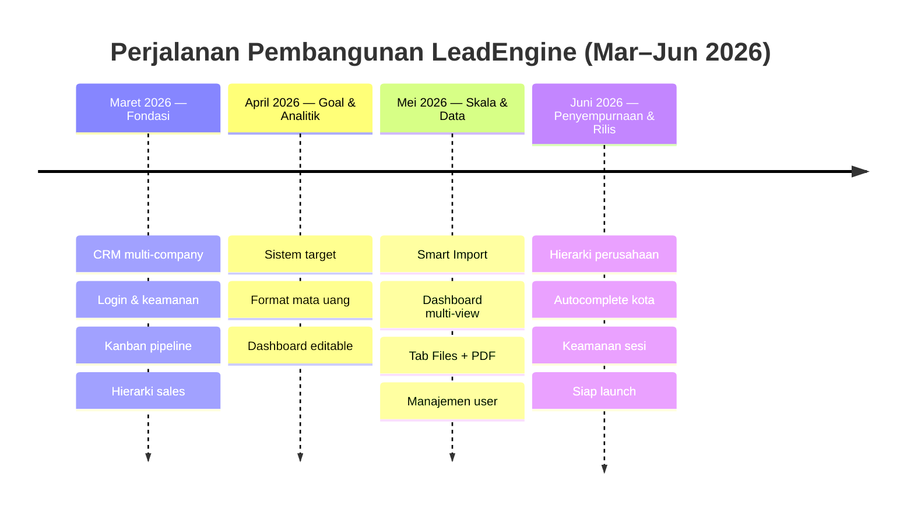
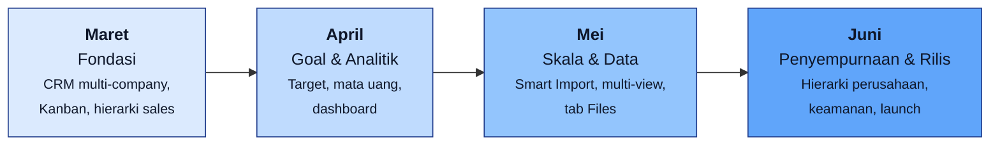

# LeadEngine — Outline Presentasi & Timeline

Dokumen pendamping untuk `journey-presentation.html`. Berisi:
1. **Diagram timeline** (siap tempel / screenshot)
2. **Outline teks per slide** (siap copy ke PowerPoint / Google Slides)

---

## 1. Diagram Timeline

### Versi ringkas (Mermaid `timeline`)

### Versi alur (Mermaid `flowchart`) — kalau mau bentuk panah

> Tips: di VS Code, buka file ini lalu klik "Open Preview" (Ctrl+Shift+V) untuk
> melihat diagram. Untuk slide: screenshot diagram, atau export via
> [mermaid.live](https://mermaid.live) ke PNG/SVG.

---

## 2. Outline Teks per Slide

Format: **Judul slide** → poin-poin isi → catatan pembicara (italic).

---

### Slide 1 — Cover

**Perjalanan LeadEngine: Dari Nol ke Platform CRM**

- Subjudul: Satu sistem terpadu untuk mengelola penjualan di seluruh unit bisnis Werkudara Group
- Periode: Maret – Juni 2026

*Pembicara: "Dalam empat bulan, kami membangun LeadEngine dari nol sampai siap dipakai resmi."*

---

### Slide 2 — Timeline (Ikhtisar)

**Empat Fase, Empat Bulan**

- Maret — Fondasi
- April — Goal & Analitik
- Mei — Skala & Data
- Juni — Penyempurnaan & Rilis

*Pembicara: "Setiap bulan punya fokus jelas, bertahap dari dasar ke fitur lanjutan."*

---

### Slide 3 — Maret: Fondasi

**Membangun Dasar Platform**

- CRM multi-company — satu platform untuk semua unit bisnis, login aman
- Kanban pipeline — papan tarik-lepas untuk memindahkan lead antar tahap
- Hierarki sales & relasi data — struktur tim, penugasan lead, relasi perusahaan & kontak

> Dampak bisnis: pondasi tunggal menggantikan pencatatan tercecer — semua tim mulai bekerja di sistem yang sama.

*Pembicara: "Di bulan pertama, fokusnya bikin fondasi yang benar — bukan sekadar tampilan."*

---

### Slide 4 — April: Goal & Analitik

**Target dan Pengukuran**

- Sistem goal & target — target penjualan dan konversi lead, dipantau di dashboard KPI
- Format mata uang per unit bisnis — nilai tampil sesuai kebutuhan masing-masing
- Perombakan dashboard — tata letak dapat diatur, data lebih akurat, grafik lebih mudah dibaca

> Dampak bisnis: manajemen mulai bisa melihat performa terhadap target secara real-time, bukan rekap manual.

*Pembicara: "Setelah data masuk, kami pastikan angkanya bisa diukur terhadap target."*

---

### Slide 5 — Mei: Skala & Data

**Bulan Tersibuk: 104 Perubahan**

- Smart Import — migrasi ribuan data lead dari spreadsheet dalam menit, dengan pencocokan nama otomatis & validasi cerdas
- Dashboard multi-view & tab Files — simpan beberapa tampilan; unggah dokumen langsung di lead, ekspor PDF
- Manajemen user & hak akses — filter peran/status/unit bisnis, pembatasan menu sesuai peran

> Dampak bisnis: data historis bisa masuk cepat dan aman, platform siap dipakai tim besar.

*Pembicara: "Mei adalah bulan paling padat — 104 perubahan, fokus ke skala dan migrasi data."*

---

### Slide 6 — Juni: Penyempurnaan & Rilis

**Pemolesan Menuju Launch**

- Hierarki perusahaan bertingkat — dukungan grup–anak perusahaan, kontak mengalir ke cabang
- Autocomplete kota & avatar — pencarian kota via Google Places, foto profil di seluruh aplikasi
- Keamanan & kesiapan rilis — satu sesi aktif per akun, polesan UI, dokumen kesiapan launch

> Dampak bisnis: platform stabil, aman, dan siap dipakai resmi di seluruh Werkudara Group.

*Pembicara: "Bulan terakhir untuk memoles detail dan memastikan siap launch."*

---

### Slide 7 — Pencapaian (Angka Kunci)

**Empat Bulan dalam Angka**

- ~199 perubahan tercatat (Maret–Juni)
- 4 bulan dari nol hingga siap produksi
- 5+ unit bisnis dalam satu platform
- Dashboard & analitik penjualan real-time

*Pembicara: "Angka-angka ini diambil dari riwayat pengembangan resmi, bukan estimasi."*

---

### Slide 8 — Sebelum vs Sesudah

**Perubahan Cara Kerja**

Sebelum:
- Data lead tercecer di banyak spreadsheet
- Tiap unit bisnis bekerja terpisah
- Rekap performa manual & lambat
- Sulit melacak target vs realisasi

Sesudah:
- Satu CRM terpusat untuk semua unit
- Dashboard real-time untuk manajemen
- Hak akses rapi sesuai peran
- Target & pencapaian terpantau otomatis

*Pembicara: "Ini inti nilainya — bukan soal teknologi, tapi cara kerja yang berubah."*

---

### Slide 9 — Arah ke Depan (Roadmap)

**Langkah Berikutnya**

- Penyempurnaan — stabilisasi pasca-launch & perbaikan dari masukan pengguna
- Analitik — laporan & forecasting penjualan yang lebih mendalam
- Otomasi — pengingat & alur kerja otomatis untuk tim sales
- Adopsi — pelatihan tim & perluasan ke seluruh unit bisnis

*Pembicara: "Launch bukan akhir — ini awal dari pengembangan berkelanjutan."*

---

## Catatan

- Outline & timeline disusun dari riwayat commit Git periode Maret–Juni 2026.
- Versi visual siap-pakai ada di `docs/journey-presentation.html` (9 slide, Print→PDF).
