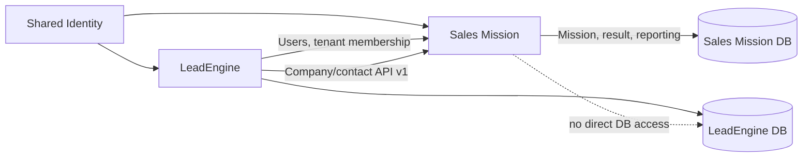
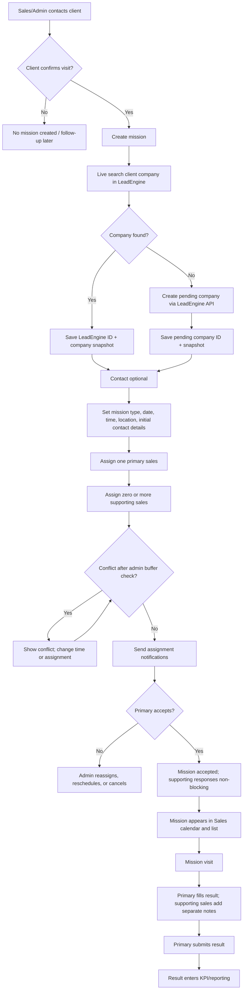
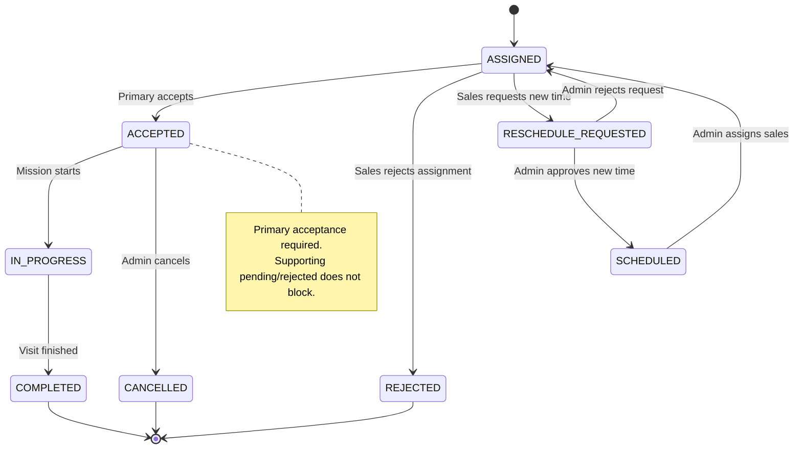
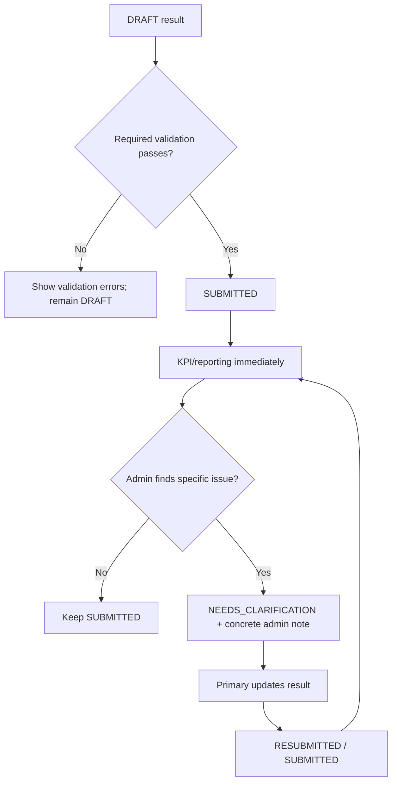
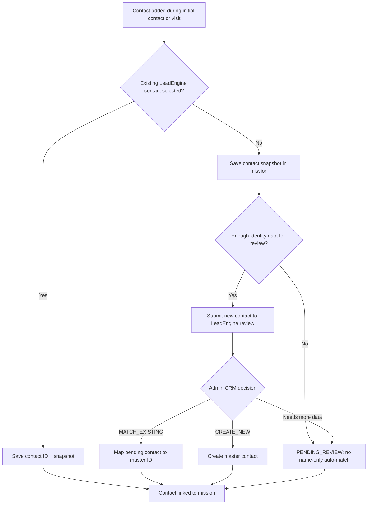
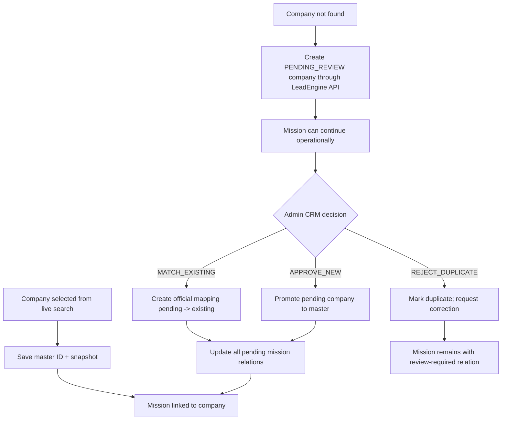
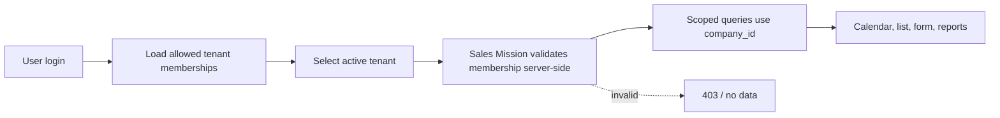
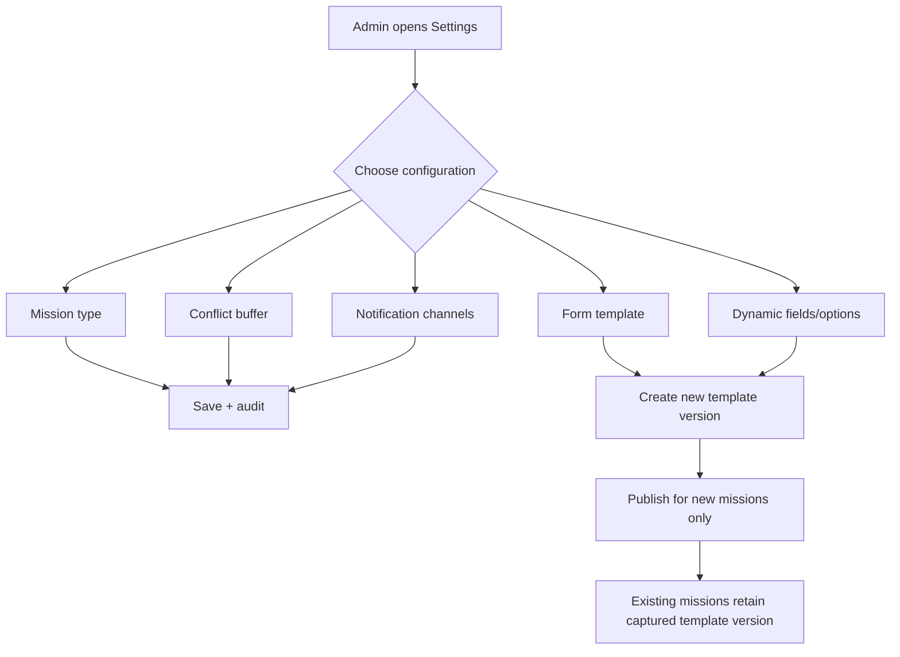
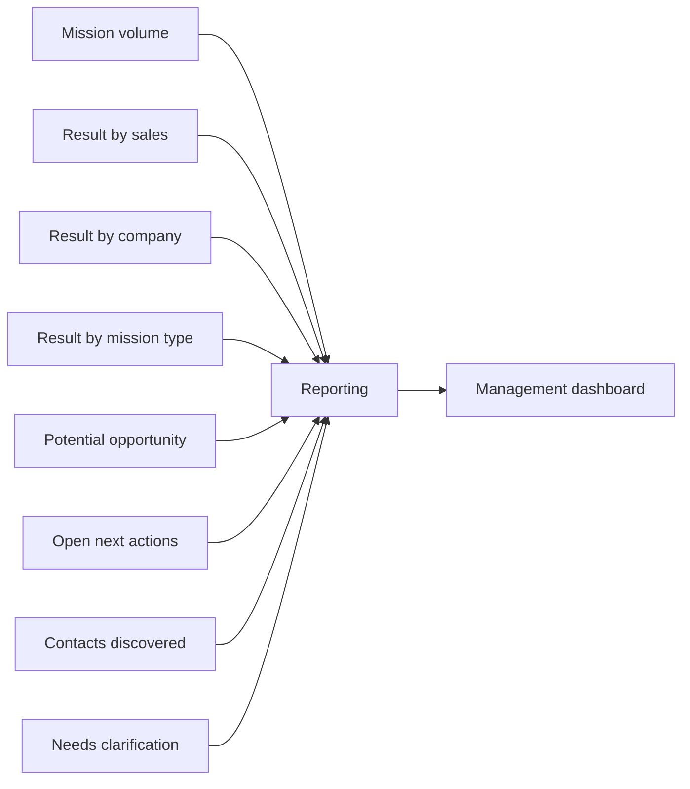

# Sales Mission Flow Diagrams

Diagrams cover MVP behavior for management, Admin, and Sales.

## 1. Platform boundary

## 2. End-to-end mission flow

## 3. Assignment response flow

## 4. Result flow

`NEEDS_CLARIFICATION` is not a generic approval gate. It records a specific question or correction request after a valid submission.

## 5. Contact capture and matching flow

One mission supports multiple contact records through a repeatable contact group.

## 6. Company review and mapping flow

The mapping updates live references. Original company name and relation history remain immutable for audit.

## 7. Tenant switch and data isolation

`company_id` is tenant scope. `client_company_id` is visited customer. They are different fields and must never be interchanged.

## 8. Admin configuration flow

## 9. Management view

