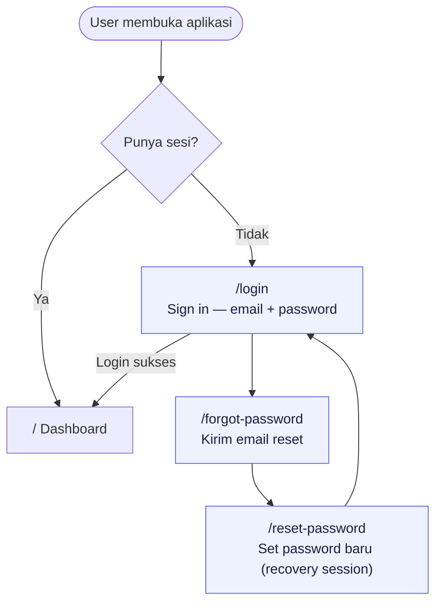
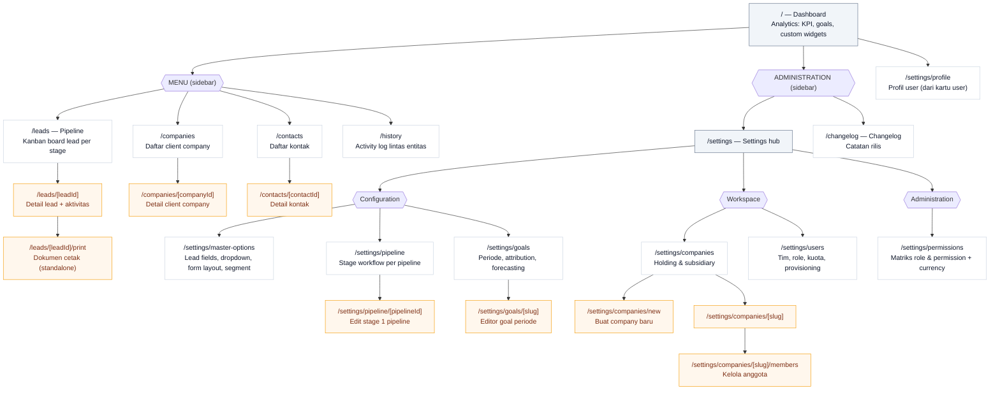

# Sitemap

LeadEngine punya dua peta alur. Sitemap untuk **alur autentikasi** (publik, tanpa app shell) dan sitemap untuk **aplikasi utama** (di balik login, dengan sidebar).

Routing memakai Next.js App Router. Setiap folder dengan `page.tsx` di `src/app/` adalah satu route. Segmen `[id]` adalah halaman detail dinamis. Visibilitas menu di sidebar dibatasi oleh permission (`can(module, action)`).

---

## 1. Auth Flow — Diagram Flow

Halaman publik yang bisa diakses tanpa sesi. Dirender standalone (tanpa sidebar) lewat pengecekan `x-pathname` di `src/proxy.ts` + root layout.

| Route | Fungsi |
|---|---|
| `/login` | Form sign in (email + password). Redirect ke `/` jika sudah login. |
| `/forgot-password` | Minta link reset password via email. |
| `/reset-password` | Set password baru. Sesi "recovery" boleh tetap di sini sampai selesai. |

---

## 2. Aplikasi Utama — Diagram Flow

Semua halaman di balik login. Dibungkus `MainLayout` (sidebar + company switcher). Urutan menu mengikuti `sidebar.tsx`.

---

## Referensi route lengkap

### Top-level (sidebar)

| Menu | Route | Permission | Keterangan |
|---|---|---|---|
| Dashboard | `/` | `dashboard.read` | Analytics dashboard: KPI cards, goals, custom widgets. |
| Pipeline | `/leads` | `leads.read` | Kanban board lead per stage. |
| Companies | `/companies` | `companies.read` | Daftar client company (CRM). |
| Contacts | `/contacts` | `contacts.read` | Daftar kontak. |
| History | `/history` | selalu tampil | Activity log lintas entitas. |
| Settings | `/settings` | `settings.read` | Hub konfigurasi workspace. |
| Changelog | `/changelog` | `settings.read` | Catatan rilis / changelog. |

### Halaman detail (dinamis)

| Route | Keterangan |
|---|---|
| `/leads/[leadId]` | Detail lead + timeline aktivitas. |
| `/leads/[leadId]/print` | Versi cetak lead (standalone, tanpa app shell). |
| `/companies/[companyId]` | Detail client company. |
| `/contacts/[contactId]` | Detail kontak. |

### Settings sub-pages

| Section | Route | Keterangan |
|---|---|---|
| Configuration | `/settings/master-options` | Lead fields, dropdown options, custom form layout, segment rules. |
| Configuration | `/settings/segments` | Pengelolaan segment (terkait master-options). |
| Configuration | `/settings/pipeline` → `/settings/pipeline/[pipelineId]` | Stage workflow per pipeline. |
| Configuration | `/settings/goals` → `/settings/goals/[slug]` | Periode, attribution, forecasting, reporting. |
| Workspace | `/settings/companies` → `/new`, `/[slug]`, `/[slug]/members` | Holding, subsidiary, member assignment. |
| Workspace | `/settings/users` | Hierarki tim, role, kuota sales, provisioning. |
| Administration | `/settings/permissions` | Matriks akses semua role + currency display. |
| — | `/settings/profile` | Profil user (diakses dari kartu user di sidebar). |
| — | `/settings/registry` | Registry field (dimension registry). |

### Lain-lain

| Route | Keterangan |
|---|---|
| `/dashboard` | Route dashboard alternatif. |
| `/goals` | Halaman goals (di luar settings). |

> Catatan: halaman auth (`/login`, `/forgot-password`, `/reset-password`) dan halaman print (`/leads/[leadId]/print`) dirender **standalone** tanpa sidebar/app shell. Logikanya ada di `src/app/layout.tsx` berdasarkan header `x-pathname` yang di-set di `src/proxy.ts`.
